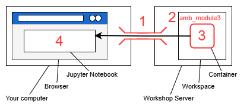
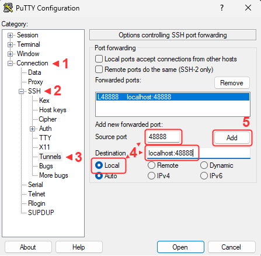
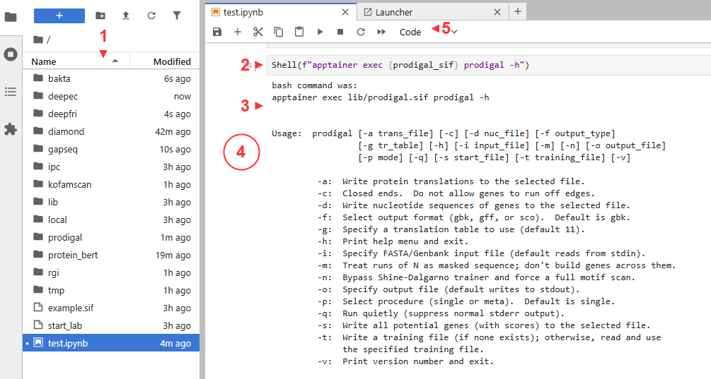
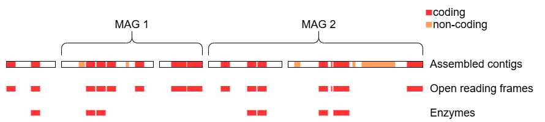

# Module 3: Assigning Functions

## Lecture

Coming soon

<!--<iframe width="640" height="360" src="" title="YouTube video player" frameborder="0" allow="accelerometer; autoplay; clipboard-write; encrypted-media; gyroscope; picture-in-picture; web-share" referrerpolicy="strict-origin-when-cross-origin" allowfullscreen></iframe>
-->

## Lab

This tutorial is part of the 2025 CBW [Advanced Microbiome Analysis](https://bioinformaticsdotca.github.io/AMB_2025/) (held in Vancouver, BC, May 29-30).

Author: Tony Liu

### Setting up the workspace

Before we begin, this section will guide you through the set up of your workspace and compute environment.
The software tools used in this lab all have dependencies that must be installed separately.
Constructing the environment for each tool is non-trivial and error-prone.
The difficulty of replicating compute environments for bioinformatics software is one of the key contributing factors
to the reproducibility crisis [1].

We will instead be using prepackaged compute environments called "containers", implemented by Apptainer (formerly Singularity) [2].
One of these containers will enable the use of jupyter notebooks along with a collection of utilities.

1.	Mangul S, Martin LS, Eskin E, Blekhman R. Improving the usability and archival stability of bioinformatics software. Genome Biol. 2019;20(1):47. https://doi.org/10.1186/s13059-019-1649-8
2.	Kurtzer GM, Sochat V, Bauer MW. Singularity: Scientific containers for mobility of compute. PLOS ONE. 2017;12(5):e0177459. https://doi.org/10.1371/journal.pone.0177459

##### Steps for setup:



1. Open an additional port via SSH for the new jupyter notebook
1. Create a new workspace directory for this lab
1. Unpack and start the container
1. Open the jupyter notebook in your browser

#### SSH port forwarding

We will use SSH port forwarding to open the additional port.

##### Terminal (Unix/MacOS)

Add `-L 48888:localhost:48888` to the SSH command you use to connect to the server. Something like:
```{bash, eval=FALSE, attr.source='.numberLines'}
ssh -L 48888:localhost:48888 ubuntu@##.uhn-hpc.ca -i CBW.pem
```
This means port `48888` on the remote server will be forwarded to your machine at `localhost:48888`.

##### Putty (Windows)

Modern versions of Windows should have `ssh` available through Powershell. Putty is available as a backup.



#### Workspace

Let's create a new workspace for this lab.

```{bash, eval=FALSE}
cd ~/workspace
mkdir amb_module3
cd amb_module3
```

Link the resource folder for easy access. This will contain all the required software and data.

```{bash, eval=FALSE}
ln -s ~/CourseData/MIC_data/amb_module3/ ./lib
```

The expected outputs for this lab can be found in `./lib/outputs`.
```{bash, eval=FALSE}
ls ./lib/outputs
```

#### Start container

Most containers for this lab were obtained from the biocontainers project, which provides a large collection of bioinformatics software in a standard format.
For each tool, we will provide URIs for the the specific container image used and where to get future versions. At the start of each section,
you will see something like:

---

https://quay.io/repository/biocontainers/prodigal?tab=tags
```{python, eval=FALSE, attr.source='.numberLines'}
# docker://quay.io/biocontainers/prodigal:2.6.3--h7b50bb2_10
prodigal_sif = LIB/"prodigal.sif"
```

---

- The link (https://quay.io/repository/biocontainers/prodigal?tab=tags) will point to the container's repository for future versions.
- The comment (`# docker://quay.io/biocontainers/prodigal:2.6.3--h7b50bb2_10`) is the *URI* for the specific version used in this lab.
- The code snippet (`prodigal_sif = LIB/"prodigal.sif"`) saves the path to the pre-downloaded container image for this lab.

After the workshop, you can use the `pull` command of `apptainer` to obtain these tools on your (linux) machine
(additional documentation: https://apptainer.org/docs/user/main/cli/apptainer_pull.html).
Here is an example for downloading the `prodigal` container image as `example.sif` from the *URI* `docker://quay.io/biocontainers/prodigal:2.6.3--h7b50bb2_10`.
The image URI takes the form of `<protocol>://<address>:<tag>`.
```{python, eval=FALSE, attr.source='.numberLines'}
apptainer pull example.sif docker://quay.io/biocontainers/prodigal:2.6.3--h7b50bb2_10
```

<details>
    <summary>What do you think is the version of prodigal versus the prodigal container image?</summary>

Prodigal: 2.6.3. Image: 2.6.3--h7b50bb2_10

</details>

We can now run the prodigal executable inside the container using `exec` (execute) like so.
```{bash, eval=FALSE}
apptainer exec ./example.sif prodigal -h
```

All containers for this lab were pre-downloaded in the resource folder now linked as `./lib`,
including a main container with Jupyter and miscellaneous utilities (https://quay.io/repository/hallamlab/cbw_amb_lab3?tab=tags).
The main container provides an automated setup script named `unpack`. Let's run it.
```{bash, eval=FALSE}
apptainer exec -B /media:/media ./lib/amb_lab3.sif unpack
```

<details>
    <summary>Container binds (`-B`)</summary>

We need to make the container aware of the original folder linked to `./lib` so that its contents become available inside the container.
Specifically, `/media` from outside the container is bound to `/media` inside the container.

</details>

The following will dedicate the current terminal to running the juptyer notebook on port 48888.
You may want to connect another terminal to maintain terminal access.
```{bash, eval=FALSE}
./start_lab
```

#### Jupyter

JupyterLab should now be accessible at http://localhost:48888/lab. Create a new python notebook and import dependencies.



1. Files are on the left
1. Cells contain executable code
1. Outputs are below each cell
1. Clicking beside the output collapses it
1. Useful functions are available in the tool bar. The `+` create additional cells

With a cell selected, you can also run it with `Shift+Enter`.

```{python, eval=FALSE, attr.source='.numberLines'}
import pandas as pd
from pathlib import Path
from local.ipc import Shell

LIB = Path("./lib")
CPUS = 4 # your workshop instance has been alloted 4 cores
```

- `pandas` enables parsing and reading of tables
- `pathlib` enables manipulation of filesystem paths
- Pre-downloaded container images are in `LIB`
- Pre-computed outputs for this lab are available at `LIB/"outputs"`.

Since containers can not be run inside other containers,
the provided `Shell` function grants access to the terminal outside of the main container.
```{python, eval=FALSE, attr.source='.numberLines'}
Shell(f"""
pwd -P
echo {LIB}
""")
```

<details>
    <summary>Python comments `# ...`</summary>

Comments are free text not meant to be interpreted as python code and are indicated by a preceeding `#`.
They are useful for leaving notes.
```{python, eval=FALSE, attr.source='.numberLines'}
# <helpful information>
```
</details>

<details>
    <summary>Python variables `CPUS = 4`</summary>

Useful values can be saved to variables using `=` for later use.
```{python, eval=FALSE, attr.source='.numberLines'}
x = 1 # the "value" 1 is assigned to the "variable" x
```
</details>

<details>
    <summary>Python functions `Shell(...)`</summary>

Functions are saved procedures that can be repeatedly executed through "calls".
Some functions recieve additional information as "arguments" or "return" information back when called.
Called functions execute their procedure and are "evaluated" to their return value.
Functions without a return evaluate to the dedicated null value `None`.
```{python, eval=FALSE, attr.source='.numberLines'}
# function definition syntax
def function_name(): # no arguments
    pass # do nothing, return nothing

# define the function "add"
def add(a, b):
    return a + b

# call function "add"
x = add(1, 2) # add evaluates to 1 + 2, then to 3, then is assigned to x
x # x is 3
```

`Shell` accepts text and executes it as a bash command.

</details>

<details>
    <summary>Python `import` and dot notation `local.ipc`</summary>

```{python, eval=FALSE, attr.source='.numberLines'}
from local.ipc import Shell # access "ipc" from "local"
```
`local` is a folder containing the file `ipc.py`, which in turn defines the function `Shell`.
`local` is a python "module" and `ipc.py` is a python "script".
`import` makes python components available from other files, typically called "libraries".
Dot notation (the period between `local` and `ipc`) retrieves the named components of complex objects.
An alternative syntax to the above is:
```{python, eval=FALSE, attr.source='.numberLines'}
import local.ipc.Shell # retrieve Shell from ipc in local
```
imported components can be renamed using the `as` keyword:
```{python, eval=FALSE, attr.source='.numberLines'}
import local.ipc.Shell as Terminal # Shell is now "Terminal"
```

</details>

<details>
    <summary>Python strings `f"..."`</summary>

Text values in python (strings), such as the contents of a bash command, must be declared in quotes like `"text"` or `'text'`.
Triple quotes allows multi-line strings. The `f` prefix enables the evaluation of python variables in the string.
For example, `f"echo {LIB}"` evaluates to `echo ./lib`.
This is a convient way to simplify commands by saving repeated sections to variables.
        
</details>

### Overview

This lab will guide you through finding and identifying the functional units encoded in the assembled metagenome from the previous labs
(represented by the red and orange features below), with a focus on proteins and enzymes.



We will begin by exploring techniques related to sequence similarity, which seeks to identify known genes through comparison with reference databases.

* [Prodigal]
* [Diamond]
* [Bakta]
* [Resistance Gene Identifier (RGI)]

Then we will transition to machine-learning tools, which move away from the "lookup table" approach of sequence similarity and towards
having an internal model that "understands" biology.

* [Kofamscan]
* [deepFRI]
* [deepEC]
* [proteinBERT]

Finally, we will use gapseq to construct metabolic models from the given MAGs.

* [gapseq]

### Prodigal

The container image for prodigal:

https://quay.io/repository/biocontainers/prodigal?tab=tags
```{python, eval=FALSE, attr.source='.numberLines'}
# docker://quay.io/biocontainers/prodigal:2.6.3--h7b50bb2_10
prodigal_sif = LIB/"prodigal.sif"
```

<details>
    <summary>How could you get prodigal for yourself?</summary>

1. Acquire apptainer (https://apptainer.org/docs/user/main/index.html)
1. `apptainer pull prodigal.sif docker://quay.io/biocontainers/prodigal:2.6.3--h7b50bb2_10`

---

</details>
<br>

The goal of prodigal is to predict the protein coding features (open reading frames; ORFs) in a given nucleotide sequence.
Recall that this corresponds to the red features in the overview diagram, neglecting the orange features for now.
It does this by optimizing predictions based on a set of tuned rules (heuristics) which take into account
gene length and overlap, start and stop codons, ribosome binding sites, and GC content [1].

1. Hyatt D, Chen GL, LoCascio PF, Land ML, Larimer FW, Hauser LJ. Prodigal: prokaryotic gene recognition and translation initiation site identification. BMC Bioinformatics. 2010;11(1):119. https://doi.org/10.1186/1471-2105-11-119

Based on this, we would expect prodigal to:

- accept a nucleotide sequence as input
- output an itemized list of predicted open reading frames

Let's have a look at prodigal's help message to get an idea of specific inputs and outputs.
```{python, eval=FALSE, attr.source='.numberLines'}
Shell(f"apptainer exec -B /media:/media {prodigal_sif} prodigal -h")
```

This looks like the input:
    
- `-i:  Specify FASTA/Genbank input file (default reads from stdin).`

These look like they are useful for the output:

- `-a:  Write protein translations to the selected file.`
- `-d:  Write nucleotide sequences of genes to the selected file.` These will be helpful next lab for aligning transcripts to genes.
- `-f:  Select output format (gbk, gff, or sco).  Default is gbk.` We will choose `gff` since the genbank output of prodigal is not in a standard formatted.
- `-o:  Specify output file (default writes to stdout).`

After a bit of investigation, it also looks like we should specify that the input is a mixed population (metagenomic).

- `-p:  Select procedure (single or meta).  Default is single.`

Have a go at compiling the final command.
```{python, eval=FALSE, attr.source='.numberLines'}
out_dir = "./prodigal"
Shell(f"""
mkdir -p {out_dir}/
apptainer exec -B /media:/media {prodigal_sif} \
    prodigal \
        -i {LIB}/inputs/assembly.fa \
        ...
""")
```

<details>
    <summary>The purpose of `\`</summary>
Starting from `apptainer exec`, the command must be written in a single line.
The backslash `\` is used to ignore the newline character and continue the command on the next line.
This let's us write break up a long command into multiple lines for readability.
---
</details>

<details>
    <summary>Why wouldn't we want to use the MAGs as input?</summary>

Not all contigs of the metagenomic assembly are in MAGs.

---

</details>

<details>
    <summary>Suggested answer</summary>

```{python, eval=FALSE, attr.source='.numberLines'}
out_dir = Path("./prodigal")
prodigal_aa = out_dir/"orfs.faa"
prodigal_gff = out_dir/"orfs.gff"
Shell(f"""\
mkdir -p {out_dir}/
apptainer exec -B /media:/media {prodigal_sif} \
    prodigal \
        -p meta \
        -i {LIB}/inputs/assembly.fa \
        -a {prodigal_aa} \
        -d {prodigal_aa.with_suffix('.fna')} \
        -f gff \
        -o {prodigal_gff} \
""")
```

---

</details>

Let's take a peek at the gene feature format (`gff`) file.
```{python, eval=FALSE, attr.source='.numberLines'}
gff = pd.read_csv(out_dir/"orfs.gff", sep="\t", header=None, comment="#")
print(gff.shape)
gff.head(2)
```

From left to right, the columns are:

0. contig id
0. name of the program that generated this feature
0. feature type, where `CDS` stands for coding sequence
0. start position (first nucleotide is 1)
0. end position
0. raw prodigal score
0. strand, where `+` is forward and `-` is reverse
0. codon frame, being one of 0, 1 or 2
0. a semicolon-separated list of tag-value pairs, providing additional information about each feature

<details>
    <summary>Selecting entries in python dataframes and matrices</summary>
Entries (rows, columns, or cells) in pandas dataframes and numpy matricies can be selected in multiple ways.

Example matrix:
```{python, eval=FALSE, attr.source='.numberLines'}
mat = np.array([1, 2, 3, 4, 5])
```

Select by single index, where negative indexes count from the end:
```{python, eval=FALSE, attr.source='.numberLines'}
mat[0]      # 1
mat[-1]     # 5
```

a slice in the form of `start:end`, where `start` is inclusive and `end` is exclusive:
```{python, eval=FALSE, attr.source='.numberLines'}
mat[1:4]    # [2, 3, 4]
mat[:2]     # [1, 2]
mat[2:]     # [3, 4, 5]
mat[-1:]    # [5]
```

a list of indexes:
```{python, eval=FALSE, attr.source='.numberLines'}
mat[[0, 2, 4]] # [1, 3, 5]
```

a boolean mask:
```{python, eval=FALSE, attr.source='.numberLines'}
mat[[False, False, False, True, True]] # [4, 5]
```

---

</details>
<br>

Let's investigate how many ORFs were not in MAGs. To do this, we will first create a blacklist for mag contig IDs.
```{python, eval=FALSE, attr.source='.numberLines'}
from Bio import SeqIO # SeqIO from Biopython enables us to read fasta files, among other formats
# https://biopython.org/wiki/SeqIO#:~:text=Peter-,File%20Formats,-The%20authorative%20list

mag_ids = set()
# loop through the paths to each of the MAG files
for mag_file in [
    LIB/"inputs/HMP2_MAG_00001-contigs.fa",
    LIB/"inputs/HMP2_MAG_00002-contigs.fa",
]:
    # we can use SeqIO to iterate through each sequence in a fasta file
    for contig in SeqIO.parse(mag_file, "fasta"):
        mag_ids.add(contig.id) # add the contig id of each contig to mag_ids
len(mag_ids)
```

<details>
    <summary>Python `for` loops</summary>

Loops enable repeated execution of a block of code for each element in a collection.
```{python, eval=FALSE, attr.source='.numberLines'}
collection = [1, 2, 3] # a "list" collection
for element in collection:
    print(element) # do something with each element

# result:
# 1
# 2
# 3
```

</details>

Then filter the gff based on the MAG blacklist.
```{python, eval=FALSE, attr.source='.numberLines'}
_filter = ~gff[0].isin(mag_ids) # column 0 is the contig id
non_mag_orfs = gff[_filter]
non_mag_orfs.shape
```

<details>
    <summary>How many contigs were in MAGs?</summary>
803
</details>

<details>
    <summary>How many ORFs were not from MAGs?</summary>
1060 of 7176, or about 15%
</details>

### Sequence similarity

In this section, we will use tools to find proteins with known sequences similar to that of the predicted ORFs.
By assuming similar sequences equate to similar functions, we can assign functions through reference databases of known proteins.
While not perfect [1, 2], this is a common first-pass approach to assign functions to genes in metagenomic assemblies.

1. Omelchenko MV, Galperin MY, Wolf YI, Koonin EV. Non-homologous isofunctional enzymes: A systematic analysis of alternative solutions in enzyme evolution. Biol Direct. 2010;5(1):31. https://doi.org/10.1186/1745-6150-5-31
1. Seffernick JL, de Souza ML, Sadowsky MJ, Wackett LP. Melamine deaminase and atrazine chlorohydrolase: 98 percent identical but functionally different. J Bacteriol. 2001;183(8):2405–10. https://doi.org/10.1128/JB.183.8.2405-2410.2001

#### Diamond

https://quay.io/repository/biocontainers/diamond?tab=tags
```{python, eval=FALSE, attr.source='.numberLines'}
# docker://quay.io/biocontainers/diamond:2.1.11--h5ca1c30_2
diamond_sif = LIB/"diamond.sif"
```

Diamond is highly optimized for finding similar protein sequences between a list of queries and a list of subjects [1].
It has a similar command line interface (CLI) to the classic BLAST, requiring that we first build a database from the list of subjects,
before searching against it with a list of queries.

1. Buchfink B, Xie C, Huson DH. Fast and sensitive protein alignment using DIAMOND. Nat Methods. 2015;12(1):59–60. https://doi.org/10.1038/nmeth.3176

We expect to run diamond in two steps:

1. Build a reference database
    - inputs: a list of protein sequences
    - outputs: a database file
1. Search the database
    - inputs: a list of protein sequences, the compiled database
    - outputs: a list of hits

```{python, eval=FALSE, attr.source='.numberLines'}
Shell(f"apptainer exec -B /media:/media {diamond_sif} diamond --help")
```

We will build a database for transporters using the transporter classification database (TCDB) [1].
TCDB has been predownloaded from these URLs.

- protein sequences: https://www.tcdb.org/public/tcdb
- sequences are grouped into families: https://www.tcdb.org/cgi-bin/projectv/public/families.py
- transporter substrates: https://www.tcdb.org/cgi-bin/substrates/getSubstrates.py

1. Saier MH Jr, Tran CV, Barabote RD. TCDB: the Transporter Classification Database for membrane transport protein analyses and information. Nucleic Acids Res. 2006;34(suppl_1):D181–6. https://doi.org/10.1093/nar/gkj001

```{python, eval=FALSE, attr.source='.numberLines'}
Shell(f"apptainer exec -B /media:/media {diamond_sif} diamond makedb")
```

The important arguments appear to be:

- `--db                     database file`
- `--in                     input reference file in FASTA format/input DAA files for merge-daa`

Have a go at compiling the command to build the diamond database.
Running a your command is a good way to check for correctness and resulting error messages can be informative.
```{python, eval=FALSE, attr.source='.numberLines'}
tcdb_fasta = LIB/"transporter_classification_db/tcdb.faa"
tcdb_db = Path("./diamond/tcdb.dmnd")
Shell(f"""
apptainer exec -B /media:/media {diamond_sif} diamond makedb \
    ...
""")
```

<details>
    <summary>Possible solution</summary>
```{python, eval=FALSE, attr.source='.numberLines'}
tcdb_fasta = LIB/"transporter_classification_db/tcdb.faa"
tcdb_db = Path("./diamond/tcdb.dmnd")
Shell(f"""
mkdir -p {tcdb_db.parent} # parent folder of given path
apptainer exec -B /media:/media {diamond_sif} diamond makedb \
    --threads {CPUS} \
    --in {tcdb_fasta} \
    --db {tcdb_db}
""")
```
</details>

Now we can search our predicted ORFs for transporters catalogued in TCDB.
```{python, eval=FALSE, attr.source='.numberLines'}
Shell(f"apptainer exec -B /media:/media {diamond_sif} diamond blastp")
```

That produced a lot of output, but these are the essential arguments:

- `--query                  input query file`
- `--db                     database file`
- `--out                    output file`

These may be frequently useful:

- `--fast                   enable fast mode`
- `--sensitive              enable sensitive mode`
- `--ultra-sensitive        enable ultra sensitive mode`
- `--threads                number of CPU threads`
- `--outfmt                 output format`
- `--evalue                 maximum e-value to report alignments (default=0.001)`

I find that this works well for general cases.
```{python, eval=FALSE, attr.source='.numberLines'}
columns = "qseqid sseqid score pident evalue"
diamond_out = Path("./diamond/orfs.tsv")
Shell(f"""
apptainer exec -B /media:/media {diamond_sif} \
    diamond blastp \
        --query ./prodigal/orfs.faa \
        --db {tcdb_db} \
        --out {diamond_out} \
        --outfmt 6 {columns} \
        --threads {CPUS}
""")
```

In addition to e-evalue, we can calculate a blast score ratio (BSR) to assign confidence to the hits.
BSR for a hit is defined as the ratio of its score to the score of the query aligned to itself (the best possible score).
A BSR of less than 0.4 was found to be a good threshold [1].

1. Rost B. Twilight zone of protein sequence alignments. Protein Eng. 1999;12(2):85–94. https://doi.org/10.1093/protein/12.2.85

Perform a self blast. We can skip making a database since the number of sequences is small.
```{python, eval=FALSE, attr.source='.numberLines'}
diamond_self = Path("./diamond/self.raw")
Shell(f"""
apptainer exec -B /media:/media {diamond_sif} \
    diamond blastp \
        --query {prodigal_aa} \
        --db {prodigal_aa} \
        --out {diamond_self} \
        --outfmt 6 {columns} \
        --max-target-seqs 1 \
        --faster \
        --threads {CPUS}
""")
```

<details>
    <summary>"string".split() and "string".join()</summary>
Strings can be split into lists using the `split` method.
```{python, eval=FALSE, attr.source='.numberLines'}
"a b c".split(" ") # ["a", "b", "c"]
"a|b|c".split("|") # ["a", "b", "c"]
"c_001_3".split("_") # ["c", "001", "3"]
```
Lists can be joined into strings using the `join` method.
```{python, eval=FALSE, attr.source='.numberLines'}
" ".join(["a", "b", "c"]) # "a b c"
"_".join(["c", "001"]) # "c_001"
```

---

</details>

We now remove hits with a BSR < 0.4. First, load in the self blast results.
```{python, eval=FALSE, attr.source='.numberLines'}
# get self scores
df_self = pd.read_csv(diamond_self, sep="\t", header=None, names=columns.split(" "))
df_self = df_self[df_self["qseqid"] == df_self["sseqid"]] # use boolean mask to select self hits
print(df_self.shape)
df_self.head(2)
```

As the code gets more complex, it may be helpful to examine individual components to increase understanding.
For example, have a look at:
```{python, eval=FALSE, attr.source='.numberLines'}
columns.split(" ")
# and
df_self["qseqid"] == df_self["sseqid"]
# or even
df_self["qseqid"]
```

Calculate BSR
```{python, eval=FALSE, attr.source='.numberLines'}
df_raw = pd.read_csv(diamond_out, sep="\t", header=None, names=columns.split(" "))
# merge in self scores by matching the qseqid
# "left" refers to a "left join" where
# each row in the left dataframe (df_raw) is found a match in the right (df_self)
# duplicate columns from the right df are suffixed with "_self", such as "score_self"
df_hits = df_raw.merge(df_self, on="qseqid", suffixes=("", "_self"), how="left")
# calculate bsr and place in new column
df_hits["bsr"] = df_hits["score"] / df_hits["score_self"] # divide each value in score by the corresponding value in score_self
df_hits.head(2)
```

Filter out hits with BSR < 0.4
```{python, eval=FALSE, attr.source='.numberLines'}
df_hits = df_hits[df_hits["bsr"] >= 0.4] # filter out rows with bsr < 0.4
df_hits = df_hits[columns.split(" ") + ["bsr"]] # keep only the columns we want
df_hits.head(2)
```

Take the best hit
```{python, eval=FALSE, attr.source='.numberLines'}
# sort by bsr and group by qseqid, keeping the first row of each group
# this will keep the best hit for each query sequence
# groupby("qseqid") will set the index to qseqid, so we reset the index
df_hits = df_hits.sort_values("bsr", ascending=False).groupby("qseqid").first().reset_index()
df_hits = df_hits.sort_values("qseqid") # re-sort by qseqid
print(df_hits.shape)
df_hits.head(2)
```

Let's plot the results using a simple diverging bar chart for each MAG. First, let's create whitelists for the contigs in each MAG.
```{python, eval=FALSE, attr.source='.numberLines'}
MAG1 = set()
for e in SeqIO.parse(LIB/"inputs/HMP2_MAG_00001-contigs.fa", "fasta"):
    MAG1.add(e.id)
MAG2 = set()
for e in SeqIO.parse(LIB/"inputs/HMP2_MAG_00002-contigs.fa", "fasta"):
    MAG2.add(e.id)
len(MAG1), len(MAG2)
```

<details>
    <summary>Python `set`</summary> 
Sets enable easy checking of membership using `in`. For example:
```{python, eval=FALSE, attr.source='.numberLines'}
empty_set = set()
X = {1, 2, 3}
1 in X # True
0 in X # False
```

---

</details>

We can use the whitelists with additional parsing to get the family and MAG for each hit.
```{python, eval=FALSE, attr.source='.numberLines'}
_fams = []
_mags = []
df_fam = pd.DataFrame(df_hits)
for _, row in df_fam.iterrows():
    orf = row["qseqid"]
    parts = orf.split("_")
    contig = "_".join(parts[:-1])
    if contig in MAG1:
        mag = 1
    elif contig in MAG2:
        mag = 2
    else:
        mag = 0 # not in either MAG
    _mags.append(mag)

    description = row["sseqid"]
    tcdb_id = description.split("|")[-1]
    parts = tcdb_id.split(".")
    family = ".".join(parts[:3])
    _fams.append(family)

df_fam["family"] = _fams
df_fam["mag"] = _mags
df_fam = df_fam[df_fam["mag"] != 0] # remove no-MAG ORFs
print(df_fam.shape)
df_fam.head(2)
```

<details>
    <summary>Python `dict`</summary>
Dictionaries enable the lookup of values by their corresponding key.
```{python, eval=FALSE, attr.source='.numberLines'}
d = {"a": 1, "b": 2, "c": 3}
d["a"] # 1
```

By using `enumerate` to provide the index of each element in an iterable (set, list, dataframe, etc.),
dictionaries that map from values to their index can be created.

```{python, eval=FALSE, attr.source='.numberLines'}
values = ["a", "b", "c"]
value2i = {value: i for i, value in enumerate(values)}
value2i["a"] # 0
```

---

</details>

To visualize the results, we will first organize the data into a matrix of counts for each transporter family and MAG.
```{python, eval=FALSE, attr.source='.numberLines'}
import numpy as np # numpy is a comprehensive math library for python

mat = np.zeros(shape=(2, df_fam["family"].nunique())) # MAGs x families
mag2i = {mag: i for i, mag in enumerate([1, 2])}
fam2j = {fam: i for i, fam in enumerate(df_fam["family"].unique())}
for _, row in df_fam.groupby(["family", "mag"])[["qseqid"]].count().reset_index().iterrows():
    i = mag2i[row["mag"]]
    j = fam2j[row["family"]]
    mat[i, j] = row["qseqid"]
order = np.argsort(-mat.sum(axis=0)) # produces a sorted list of indexes
```

Let's also load in the human-readable names of the transporter families from the TCDB metadata table.
```{python, eval=FALSE, attr.source='.numberLines'}
df_tcdb = pd.read_csv(LIB/"transporter_classification_db/families.tsv", sep="\t", header=None, names=["key", "name"])
tcdb_families = {row["key"]: row["name"] for _, row in df_tcdb.iterrows()}
print(df_tcdb.shape)
df_tcdb.head(2)
```

`BaseFigure` and `ApplyTemplate` are utility functions that we have provided to make simple figures with `Ploty`.
Let's use them to compare the abundance of transporter families in each MAG with a diverging bar plot.
(https://plotly.com/python/bar-charts/). Heatmaps may be suitable for a larger number of MAGs (https://plotly.com/python/heatmaps/).
```{python, eval=FALSE, attr.source='.numberLines'}
from local.figures.template import BaseFigure, ApplyTemplate, go

family_labels = np.array([tcdb_families[k] for k in fam2j.keys()])
TOP_K = 10
fig = BaseFigure()
for mag in [1, 2]:
    i = mag2i[mag]
    sign = -1 if mag == 1 else 1 # -1 for left bar
    fig.add_trace(
        go.Bar(
            x = sign*mat[i, order[:TOP_K]],     # length of each bar
            y = family_labels[order[:TOP_K]],   # name of each row
            orientation='h',
            name = f"MAG{mag}",
        )
    )
    # break # this will only draw the bars of one MAG. Uncomment "break" to see what each trace is drawing.

fig = ApplyTemplate(
    fig,
    layout=dict(
        legend_orientation ='h',
        barmode="relative",
        width=1000, height=400,
    ),
)
fig.show()
```

<details>
    <summary>What family of transporters was most prevalent overall vs in each MAG?</summary>
Overall: ABC transporters
MAG1 (blue): sugar transporters
MAG2 (red): susD, RND, MFS, and OMR

---

</details>

<details>
    <summary>Are the results normalized?</summary>
No. We could divide by the total number of ORFs in each MAG to prevent larger MAGs from having more transporters in a category by virtue of overall size.

---

</details>

<details>
    <summary>How to change the figure to show the top 3 instead?</summary>
```{python, eval=FALSE, attr.source='.numberLines'}
TOP_K = 3
```

---

</details>

<details>
    <summary>Can you put MAG1 on the right and MAG2 on the left?</summary>
```{python, eval=FALSE, attr.source='.numberLines'}
    sign = -1 if mag == 2 else 1
```

---

</details>

#### Bakta

https://quay.io/repository/biocontainers/bakta?tab=tags
```{python, eval=FALSE, attr.source='.numberLines'}
# docker://quay.io/biocontainers/bakta:1.9.4--pyhdfd78af_0
bakta_sif = LIB/"bakta.sif"
```

Bakta is an automated workflow for annotating both coding and non-coding features using a variety of tools [1].
Its core protocol can be reduced to ORF prediction by Prodigal, followed by sequence similary search by Diamond, as we have just done.
Many additional tools and consolidated reference databases are used to search for non-coding features, provide information on ORFs with no good hits in any database, and perform QC.

1. Schwengers O, Jelonek L, Dieckmann MA, Beyvers S, Blom J, Goesmann A. Bakta: rapid and standardized annotation of bacterial genomes via alignment-free sequence identification. Microb Genomics. 2021;7(11):000685. https://doi.org/10.1099/mgen.0.000685

To run Bakta, we expect to first set up reference databases before it will:

- accept contigs, for which it will first run Prodigal for us
- or accept a list of regions + contigs, for which Prodigal will be skipped
- and produce many files containing useful annotations

<details>
    <summary>Why is a protein sequence fasta insufficient to fully utilize Bakta?</summary>
Non-coding features would not be represented.

---

</details>

The database was pre-installed, but here is some code to guide you if you decide to revisit in the future.

```{python, eval=FALSE, attr.source='.numberLines'}
Shell(f"apptainer exec -B /media:/media {bakta_sif} bakta_db list")
```

```{python, eval=FALSE, attr.source='.numberLines'}
# bakta_db = LIB/"bakta_db/db"        # 2 hours, ~70 GB
bakta_db = LIB/"bakta_db/db-light"  # 30 mins, ~3.5 GB
if not bakta_db.exists():
    if "light" in str(bakta_db):
        _type = "light"
    else:
        _type = "full"
    Shell(f"apptainer exec -B /media:/media {bakta_sif} bakta_db download --output {bakta_db} --type {_type}")
```

There may be other annotation tools that we wish to run in addition to Bakta, which depend on predicted ORFs.
Waiting for Bakta to finish before we recieve the predicted ORFs may be inconvenient, especially for large metagenomic datasets.
Running Prodigal ourselves and passing the ORFs to Bakta frees us to run additional tools in parallel. Bakta does not accept ORFs
that run off the edge of contigs, so we will need to filter these out. 

```{python, eval=FALSE, attr.source='.numberLines'}
gff = pd.read_csv(prodigal_gff, sep="\t", header=None, comment="#")
complete_orfs = [] # a boolean mask
for _, row in gff.iterrows():
    meta = tuple(row)[-1]
    if "partial=00" in meta:
        complete_orfs.append(True)
    else:
        complete_orfs.append(False)

gff_complete = "./prodigal/orfs.complete.gff"
gff[complete_orfs].to_csv(gff_complete, sep="\t", header=False, index=False)
```

Running Bakta, even on this reduced dataset, may take **15+ minutes**. Precomputed outputs are available at `{LIB}/outputs/bakta.full`.
```{python, eval=FALSE, attr.source='.numberLines'}
Shell(f"""
apptainer exec -B /media:/media {bakta_sif} \
    bakta --meta --threads {CPUS} --force --skip-plot \
        --db {bakta_db} \
        --keep-contig-headers \
        --output ./bakta/ \
        --regions {gff_complete} \
        {LIB}/inputs/assembly.fa
""")
```

Have a look at the reported hypothetical proteins at `LIB/"outputs/bakta.full/assembly.hypotheticals.tsv"` and read the results into a dataframe.

```{python, eval=FALSE, attr.source='.numberLines'}
bakta_hyp = LIB/"outputs/bakta.full/assembly.hypotheticals.tsv"
with open(bakta_hyp) as file:
    print(file.read())
```

- use `pd.read_csv(...)`
- use the argument `sep="..."` to change the separator for columns
- use the argument `skiprows=...` to skip the initial comments

<details>
    <summary>How many hypotheticals did Bakta report?</summary>
828
```{python, eval=FALSE, attr.source='.numberLines'}
df = pd.read_csv(bakta_hyp, sep="\t", skiprows=2)
df
```

---

</details>

#### Resistance Gene Identifier (RGI)

(Optional: For when you want to use a specific database, in this case, we will demo antibiotic resistance)

---

https://quay.io/repository/biocontainers/rgi?tab=tags
```{python, eval=FALSE, attr.source='.numberLines'}
# docker://quay.io/biocontainers/rgi:6.0.4--pyh05cac1d_0
rgi_sif = LIB/"rgi.sif"
```

Sometimes, specific functions are of interest, such as antibiotic resistance.
RGI is a tool for searching the Comprehensive Antibiotic Resistance Database (CARD) [1, 2] using tuned protocols for Diamond.

1. McArthur AG, Waglechner N, Nizam F, Yan A, Azad MA, Baylay AJ, et al. The Comprehensive Antibiotic Resistance Database. Antimicrob Agents Chemother. 2013;57(7):3348–57. https://doi.org/10.1128/aac.00419-13
1.	Alcock BP, Huynh W, Chalil R, Smith KW, Raphenya AR, Wlodarski MA, et al. CARD 2023: expanded curation, support for machine learning, and resistome prediction at the Comprehensive Antibiotic Resistance Database. Nucleic Acids Res. 2023;51(D1):D690–9. https://doi.org/10.1093/nar/gkac920

```{python, eval=FALSE, attr.source='.numberLines'}
Shell(f"apptainer exec -B /media:/media {rgi_sif} rgi --help")
```

```{python, eval=FALSE, attr.source='.numberLines'}
Shell(f"apptainer exec -B /media:/media {rgi_sif} rgi main --help")
```

Errors are a common occurrence for bioinformatics tools. The following is a command which appears to be correct,
but will nonetheless fail. Read the error messages and use the hints to fix the issue. Additional warnings will appear
that do not crash the program. These can be ignored. RGI also provides no indication of progress or successful completion,
so checking the output folder will be necessary.
```{python, eval=FALSE, attr.source='.numberLines'}
rgi_out = Path("./rgi/chicken")
Shell(f"""
apptainer exec -B /media:/media {rgi_sif} \
    rgi main \
        --num_threads {CPUS} \
        --clean \
        -i {prodigal_aa} \
        -o {rgi_out}
""")
```

<details>
    <summary>`FileNotFoundError` hint</summary>
Is the path to the missing file related to any of the paths we gave it?
</details>

<details>
    <summary>`FileNotFoundError` explanation</summary>
We indicated an output path within a new folder `rgi_out = Path("./rgi/chicken")`. It appears that RGI can't make this folder for us,
so we will have to create it ourselves with `mkdir -p {rgi_out.parent}`. `parent` refers to the parent folder.
</details>

<details>
    <summary>`invalid fasta` hint</summary>
Nucleotide?
</details>

<details>
    <summary>`invalid fasta` explanation</summary>
We can use the argument `-t protein` to indicate that the input is a protein sequence.
</details>

<details>
    <summary>solution</summary>
```{python, eval=FALSE, attr.source='.numberLines'}
rgi_out = Path("./rgi/chicken")
Shell(f"""
mkdir -p {rgi_out.parent}
apptainer exec -B /media:/media {rgi_sif} \
    rgi main \
        --num_threads {CPUS} \
        --clean \
        -t protein \
        -i {prodigal_aa} \
        -o {rgi_out}
""")
rgi_out = rgi_out.with_suffix(".txt") # RGI adds the .txt suffix
# or
# rgi_out = Path("./rgi/chicken.txt")
```

---

</details>

Let's take a quick peak at the results.
```{python, eval=FALSE, attr.source='.numberLines'}
_df = pd.read_csv(rgi_out, sep="\t", header=0)
_df
```

<details>
    <summary>How many resistance genes did we find?</summary>
Just 10!
</details>

### Machine learning

Alignment-based approaches that assign functional annotations based on sequence similarity rely on databases of known sequnces
to transfer their known functions to the ORFs of a given sample. Machine learning may be able to discover more general patterns
that can extend annotations to previously unseen sequences. 

#### Kofamscan

https://quay.io/repository/hallamlab/external_kofamscan?tab=tags
```{python, eval=FALSE, attr.source='.numberLines'}
# docker://quay.io/hallamlab/external_kofamscan:1.3.0
kofamscan_sif = LIB/"kofamscan.sif"
```

Kofamscan uses a machine learning technique called hidden markov models to learn the amino acid sequence patterns
accociated with various functions, organized in the KEGG database [1, 2]. Kofamscan sits somewhere in the middle
between alignment-based and machine learning-based annotation methods.

1. Aramaki T, Blanc-Mathieu R, Endo H, Ohkubo K, Kanehisa M, Goto S, et al. KofamKOALA: KEGG Ortholog assignment based on profile HMM and adaptive score threshold. Bioinformatics. 2020;36(7):2251–2. https://doi.org/10.1093/bioinformatics/btz859
1. Kanehisa M, Goto S. KEGG: Kyoto Encyclopedia of Genes and Genomes. Nucleic Acids Res. 2000;28(1):27–30. https://doi.org/10.1093/nar/28.1.27

```{python, eval=FALSE, attr.source='.numberLines'}
Shell(f"apptainer exec -B /media:/media {kofamscan_sif} kofamscan --help") # expect crash
```
It looks like we can't even get a help message with a naiive call to the tool.
Let's check the documentation for some clues. Specifically, there is short section marked `## Usage` that will be helpful.

https://www.genome.jp/ftp/tools/kofam_scan/README.md

Ah, so the executable is `exec_annotation`.
```{python, eval=FALSE, attr.source='.numberLines'}
Shell(f"apptainer exec -B /media:/media {kofamscan_sif} exec_annotation --help")
```

Kofamscan needs pre-trained HMM models, which have been downloaded from these links.

- `ftp://ftp.genome.jp/pub/db/kofam/ko_list.gz`
- `ftp://ftp.genome.jp/pub/db/kofam/profiles.tar.gz`

**Kofamscan will take a long time to run.** Use the pre-computed outputs at `LIB/"outputs/kofamscan/kos.out"`.
To try running kofamscan, use the shorter list of hypotheticals from Bakta at `LIB/"outputs/bakta.full/assembly.hypotheticals.faa`. 
```{python, eval=FALSE, attr.source='.numberLines'}
kofamscan_raw = Path("./kofamscan/kos.out")
Shell(f"""
mkdir -p ./kofamscan
apptainer exec -B /media:/media {kofamscan_sif} \
    exec_annotation \
        --cpu={CPUS} --format=detail --no-report-unannotated \
        --profile={LIB}/kofamscan_db/profiles/prokaryote.hal \
        --ko-list={LIB}/kofamscan_db/ko_list \
        -o {kofamscan_raw} \
        {prodigal_aa}
""")
```

Kofamscan attempts to assign KEGG orthology (KO) numbers to each ORF, linking them to rich KEGG databases
which provide hierachical organization and metabolic context. We can use the provided utility to parse the
results into a partial model of KEGG for local use.

```{python, eval=FALSE, attr.source='.numberLines'}
from local.models.kegg_orthology import ParseKofamScanResults

kofamscan_raw = LIB/"outputs/kofamscan/kos.out"
model = ParseKofamScanResults(
    kofamscan_raw,
    LIB/"kofamscan_db/api_kegg.db",
    LIB/"kofamscan_db/brite.json",
)
```

Have a look at the number of predicted functions in each category.
```{python, eval=FALSE, attr.source='.numberLines'}
model.Summary()
```

And the actual table of results. Kofamscan reports the confidence score, as well as the recommended threshold for each assignment.
```{python, eval=FALSE, attr.source='.numberLines'}
df = model.df
df = df[df.score > df.hmm_threshold] # retrieve only assignments that pass the model's adaptive confidence threshold
print(df.shape)
df.head(2)
```

Let's take a peek at a KEGG database entry.
```{python, eval=FALSE, attr.source='.numberLines'}
model.GetComponentModel("K06442")._raw
```

We can also look at where the assigned function sits in the BRITE functional hierarchy.
```{python, eval=FALSE, attr.source='.numberLines'}
for lineage in model.GetLineage("K06442"):
    for k in lineage:
        print(model.GetNodeInfo(k))
```

`GetCategories` provides a shorthand to retrieve 2 useful levels from the BRITE heriarchy.
```{python, eval=FALSE, attr.source='.numberLines'}
for l2, l1 in model.GetCategories("K06442"):
    for k in [l2, l1]:
        print(model.GetNodeInfo(k))
```

Just like what we did with transporters, let's visualize the abundance of functions aggregated by BRITE
categories for each MAG. First, we will compile a count of each category by MAG.
```{python, eval=FALSE, attr.source='.numberLines'}
rows = []
for _, row in df.iterrows():
    ko = row["ko"]
    orf = row["orf"]
    contig = "_".join(orf.split("_")[:-1])
    if contig in MAG1:
        mag = 1
    elif contig in MAG2:
        mag = 2
    else:
        mag = 0 # not in either MAG
    for category, _ in model.GetCategories(ko):
        rows.append((mag, category))
df_temp = pd.DataFrame(rows, columns=["mag", "category"])
```

Then, we can organize the information in a matrix for easy plotting.
```{python, eval=FALSE, attr.source='.numberLines'}
# create some index lookup dictionaries for the matrix
c2i = {c: i for i, c in enumerate(df_temp["category"].unique())}    # category to index
mag2i = {mag: i for i, mag in enumerate([1, 2])}                    # mag to index
mat = np.zeros(shape=(len(mag2i), len(c2i))) # MAG x categories
# iterate through the counts for each mag
# assigning them to the correct cell using the index lookup dictionaries
for _, row in df_temp.iterrows():
    mag = row["mag"]
    if mag == 0: continue
    i = mag2i[mag]
    j = c2i[row["category"]]
    mat[i, j] += 1

order = np.argsort(-mat.sum(axis=0)) # get the order of categories by size (largest -> smallest)
mat.sum(axis=1)
```

Plot the top 10 largest categories.
```{python, eval=FALSE, attr.source='.numberLines'}
from local.figures.template import BaseFigure, ApplyTemplate, go

category_labels = np.array([model.GetNodeInfo(k)[1] for k in c2i.keys()])
K = 10
fig = BaseFigure()
for mag in [1, 2]:
    i = mag2i[mag]
    sign = -1 if mag == 1 else 1
    fig.add_trace(
        go.Bar(
            x = sign*mat[i, order[:K]],
            y = category_labels[order[:K]],
            orientation='h',
            name = f"MAG{mag}",
        )
    )

fig = ApplyTemplate(
    fig,
    layout=dict(
        legend_orientation ='h',
        barmode="relative",
        width=1000, height=400,
    ),
)
fig.show()
```

#### deepEC

(Optional: For predicting enzymes)

---

https://quay.io/repository/hallamlab/external_deepec?tab=tags
```{python, eval=FALSE, attr.source='.numberLines'}
# docker://quay.io/hallamlab/external_deepec:0.4.1
deepec_sif = LIB/"deepec.sif"
```

The DeepEC model uses convolutional neural networks, a deep learning architecture that is not far from HMM approach of Kofamscan.
It too scans the protein sequence and attempts to predict function based on the "topology" or motif structure of the amino acid sequences.
However, the model is able to make additional abstract decisions after the results of the initial scan in the form of additional model layers,
further differentiating it from the sequence similarity approach [1]. As the name suggests, deepEC predicts enzyme commission (EC) numbers,
which are unique IDs that link to various metabolic reference databases, including KEGG. It is straightforward to run.

1. Ryu JY, Kim HU, Lee SY. Deep learning enables high-quality and high-throughput prediction of enzyme commission numbers. Proc Natl Acad Sci. 2019;116(28):13996–4001. https://doi.org/10.1073/pnas.1821905116


```{python, eval=FALSE, attr.source='.numberLines'}
Shell(f"""
apptainer exec -B /media:/media {deepec_sif} \
    deepec \
        -p {CPUS} \
        -i {prodigal_aa} \
        -o ./deepec
""")
```

```{python, eval=FALSE, attr.source='.numberLines'}
dfec = pd.read_csv("./deepec/DeepEC_Result.txt", sep="\t")
print(dfec.shape)
dfec.head(2)
```

<details>
    <summary>How many ORFs did deepEC assign EC numbers to?</summary>
87 out of 7176

---

</details>

#### deepFRI

(Optional: For predicting Gene Ontology (GO) functions)

---

https://quay.io/repository/hallamlab/external_deepfri?tab=tags
```{python, eval=FALSE, attr.source='.numberLines'}
# docker://quay.io/hallamlab/external_deepfri:1.0.1
deepfri_sif = LIB/"deepfri.sif"
```

Deep learning models are able to consider the protein sequence at a higher-level of abstraction, but what is it abstracting to?
We often don't know the mental model of protein function that these approaches have constucted for themselves, but deepFRI provides
an example that can ease us into the deep learning world. DeepFRI predicts function by first examining the potential structure
of a protein sequence by predicting the pairwise distances between all amino acids in the form of a "contact map" [1]. The final output
are Gene ontology (GO) numbers, which are an alternative to KEGG more common in medical settings. 

1. Gligorijević V, Renfrew PD, Kosciolek T, Leman JK, Berenberg D, Vatanen T, et al. Structure-based protein function prediction using graph convolutional networks. Nat Commun. 2021;12(1):3168. https://doi.org/10.1038/s41467-021-23303-9

DeepFRI is quite tempermental. We must remove the `*` character indicating stop codons from the prodigal output.
We must also create and run it within a dedicated output folder, while using absolute paths.
As it runs, it will dump files into the current directory despite us telling it otherwise.
Try with the reduced set of hypotheticals (`{LIB}/"outputs/bakta.full/assembly.hypotheticals.faa"`).
Pre-computed results are at (`{LIB}/"outputs/deepfri/`).

```{python, eval=FALSE, attr.source='.numberLines'}
deepfri_out = Path("./deepfri")
if not deepfri_out.exists():
    deepfri_out.mkdir(parents=True)
aa_no_stop = deepfri_out/"orfs.no_stop.faa"
_orfs = LIB/"outputs/bakta.full/assembly.hypotheticals.faa"
# _orfs = prodigal_aa # this would take too long
with open(aa_no_stop, "w") as f:
    for e in SeqIO.parse(_orfs, "fasta"):
        if e.seq[-1] == "*":
            e.seq = e.seq[:-1]
        SeqIO.write(e, f, "fasta")
```

```{python, eval=FALSE, attr.source='.numberLines'}
Shell(f"""
cd {deepfri_out}
apptainer exec -B ./:/ws -W /ws ../{deepfri_sif} \
    deepfri \
        --ont mf bp ec \
        --fasta_fn /ws/{prodigal_aa_no_stop.name} \
        --output_fn_prefix /ws/hypotheticals
""")
```

EC:
```{python, eval=FALSE, attr.source='.numberLines'}
df = pd.read_csv(LIB/"outputs/deepfri/chicken_EC_predictions.csv", comment="#")
print(df.shape)
df.head(2)
```

GO molecular function
```{python, eval=FALSE, attr.source='.numberLines'}
df = pd.read_csv(LIB/"outputs/deepfri/chicken_MF_predictions.csv", comment="#")
print(df.shape)
df.head(2)
```

GO biological process
```{python, eval=FALSE, attr.source='.numberLines'}
df = pd.read_csv(LIB/"outputs/deepfri/chicken_BP_predictions.csv", comment="#")
print(df.shape)
df.head(2)
```

Have a look at the predicted functions for Bakta's 828 hypothetical proteins. Since multiple predictions are given per protein,
use `df["Protein"].nunique()` to get the number of proteins with at least 1 prediction. Use the argument `comment="#"` to skip comments in the file.

<details>
    <summary>How many hypothetical proteins were assigned functions?</summary>

679
```{python, eval=FALSE, attr.source='.numberLines'}
df = pd.read_csv("./deepfri/hypotheticals_EC_predictions.csv", comment="#")
print(df.shape, df["Protein"].nunique())
df.head(2)
```

---

</details>

<details>
    <summary>Do you trust these predictions?</summary>

The model itself is not even confident, assigning scores as low as 0.1 in some cases.

---

</details>

#### proteinBERT

(Optional: For previously unseen hypothetical proteins)

---

https://quay.io/repository/hallamlab/external_proteinbert?tab=tags
```{python, eval=FALSE, attr.source='.numberLines'}
# docker://quay.io/hallamlab/external_proteinbert:2024.03.28
proteinbert_sif = LIB/"proteinbert.sif"
```

ProteinBERT "reads" protein sequences like how we read text. The core of its architecture is an attention mechanism that is 
part of what's called a "transformer", often used in natural language processing [1, 2]. Amino acid sequence context is considered by
predicting the importance of pair-wise relationships between all residues, enabling the model to "focus" on what it thinks are important motifs.
The pairwise attention could be spatial distance, as in deepFRI, but is not strictly limited to this interpretation,
hence further abstracting the model. The core transformer architecture is used in current large language models like ChatGPT.
The only difference is that ChatGPT is much, much larger.

1. Vaswani A, Shazeer N, Parmar N, Uszkoreit J, Jones L, Gomez AN, et al. Attention is all you need. Curran Associates Inc.; 2017. (NIPS’17).
1. Brandes N, Ofer D, Peleg Y, Rappoport N, Linial M. ProteinBERT: a universal deep-learning model of protein sequence and function. Bioinformatics. 2022;38(8):2102–10. https://doi.org/10.1093/bioinformatics/btac020

This will take a few minutes. Feel free to skip and use (`LIB/"outputs/protein_bert"`).
```{python, eval=FALSE, attr.source='.numberLines'}
Shell(f"""
apptainer exec -B /media:/media {proteinbert_sif} \
    pbert run \
        --threads {CPUS} \
        -i {prodigal_aa} \
        -o protein_bert
""")
```

The output of proteinBERT is an array of numbers for each ORF, representing their predicted function.
These numbers can be interpreted as coordinates in proteinBERT's mental model.
We say each ORF is embedded in proteinBERT's functional space. The euclidean distance between each ORF's
embedding represents predicted functional similarity.
```{python, eval=FALSE, attr.source='.numberLines'}
df_index = pd.read_csv("./protein_bert/orfs.csv")
print(df_index.shape)
df_index.head(2)
```

ProteinBERT has 6 transformer layers, each of which reads and paraphrases the amino acid sequence for the next layer.
This information is stored in a 512-dimensional vector for each ORF, so the total embedding matrix is
`N_orfs x (6x512)`.
```{python, eval=FALSE, attr.source='.numberLines'}
mats = []
for batch in sorted(df_index.batch.unique()):
    mats.append(np.load(f"./protein_bert/orfs.{batch}.embedding.npy"))
mat = np.vstack(mats)
mat.shape
```

Examining the standard deviation of the embeddings for each layers reveals that the last layer has the most to say,
so we will use it to reduce needed compute.
```{python, eval=FALSE, attr.source='.numberLines'}
fig = BaseFigure()
fig.add_trace(
    go.Scatter(
        x=np.arange(mat.shape[0]),
        y=mat.std(axis=0),
        mode="markers",
        marker=dict(size=2),
    )
)
fig = ApplyTemplate(fig, default_xaxis=dict(dtick=512))
fig.show()
```

```{python, eval=FALSE, attr.source='.numberLines'}
mat_last = mat[:, -512:]
mat_last.shape
```

Let's load the kofamscan results to provide KEGG landmarks for these embeddings.
```{python, eval=FALSE, attr.source='.numberLines'}
LIB = Path("./lib")
kofamscan_raw = Path("./kofamscan/kos.out")
```

```{python, eval=FALSE, attr.source='.numberLines'}
from local.models.kegg_orthology import ParseKofamScanResults

ko_model = ParseKofamScanResults(
    kofamscan_raw,
    LIB/"kofamscan_db/api_kegg.db",
    LIB/"kofamscan_db/brite.json",
)
```

```{python, eval=FALSE, attr.source='.numberLines'}
df_kofam = ko_model.df
df_kofam = df_kofam[df_kofam["score"]>df_kofam["hmm_threshold"]]
print(df_kofam.shape)
df_kofam.head(2)
```

Let's aggregate the functions to the second level of the BRITE hierarchy. Since ORFs can be in multiple categories,
we will sort the list of categories by size to assign ORFs to their largest parent category.
```{python, eval=FALSE, attr.source='.numberLines'}
categories = {}
for _, row in df_kofam.iterrows():
    ko = row["ko"]
    orf = row["orf"]
    for brite2, brite1 in ko_model.GetCategories(ko):
        categories[brite2] = categories.get(brite2, set()) | {orf}

categories = sorted(categories.items(), key=lambda x: len(x[1]), reverse=True)
len(categories)
```

```{python, eval=FALSE, attr.source='.numberLines'}
orf2cat = {}
for brite2, orfs in categories:
    for orf in orfs:
        if orf in orf2cat: continue
        orf2cat[orf] = brite2
cat2i = {cat: i+1 for i, (cat, _) in enumerate(categories)}

y_categories = []
for _, row in df_index.iterrows():
    orf = row["id"]
    brite2 = orf2cat.get(orf, "None")
    i = cat2i.get(brite2, 0)
    y_categories.append(i)
```

We can use UMAP to reduce the 512 dimensional embeddings to 2 dimensions for visualization
and use the BRITE categories as a guide. This will give a few warnings, but that's ok.
```{python, eval=FALSE, attr.source='.numberLines'}
from umap import UMAP

# https://umap-learn.readthedocs.io/en/latest/parameters.html
model = UMAP(
    n_components=2, # reduce to x, y
    spread=5,       # spread out the points
    min_dist=0.1,   # reduce the maximum density of points
    metric="cosine",
)

emb = model.fit_transform(mat_last, y=y_categories)
```

Let's have a look.
```{python, eval=FALSE, attr.source='.numberLines'}
from local.figures.template import BaseFigure, ApplyTemplate, go
from local.figures.colors import Palettes, COLORS

fig = BaseFigure()

K = 10
seen = set()
todo = []
for brite2, _ in categories[:K]:
    _filter = [orf2cat.get(orf) == brite2 for orf in df_index["id"]]
    seen |= set(orfs)
    todo.append((brite2, _filter))
_palette = Palettes.PLOTLY
for i, (name, _filter) in enumerate(todo):
    fig.add_trace(
        go.Scatter(
            name=ko_model.GetNodeInfo(name)[1],
            x=emb[_filter, 0],
            y=emb[_filter, 1],
            text=df_index[_filter]["id"],
            mode="markers",
            marker=dict(
                size=10,
                color=COLORS.TRANSPARENT,
                line=dict(
                    width=1,
                    color=_palette[i%len(_palette)].color_value,
                ),
            ),
        )
    )

# plot rest as gray dots
_filter = ~df_index["id"].isin(seen)
fig.add_trace(
    go.Scatter(
        name="other",
        x=emb[_filter, 0],
        y=emb[_filter, 1],
        text=df_index[_filter]["id"],
        mode="markers",
        marker=dict(
            size=5, opacity=0.1,
            color=COLORS.GRAY,
        ),
    )
)
no_axis = dict(linecolor=COLORS.TRANSPARENT, ticks=None, showticklabels=False)
fig = ApplyTemplate(
    fig,
    default_xaxis=no_axis, default_yaxis=no_axis,
    layout=dict(
        width=1000,
        height=700,
    ),
)
fig.show()
```

<details>
    <summary>What are the gray dots?</summary>
These are ORFs not in the top K categories, including ORFs of unknown function.

---

</details>

<details>
    <summary>What functions seem to be well mapped or not well mapped?</summary>
Transporters (blue) and DNA repair (yellow) seem to be well mapped with distinct regions.
Carbohydrate metabolism (red) exhibits a bit of a spread and overlaps with other categories, 
Likely reflecting the greater sequence diversity of enzymes in this category. 

---

</details>

<details>
    <summary>
Suppose a hypothetical protein was placed near other proteins labelled as "membrane transport".
What can we say about the hypothetical protein's function?
    </summary>
ProteinBERT has predicted that the hypothetical protein is functionally similar to transporters, suggestig that "membrane transport"
be transferred to the hypothetical protein's annotation.

---

</details>

### gapseq

https://quay.io/repository/biocontainers/gapseq?tab=tags
```{python, eval=FALSE, attr.source='.numberLines'}
# docker://quay.io/biocontainers/gapseq:1.4.0--h9ee0642_1
gapseq_sif = LIB/"gapseq.sif"
```

So far, we have used various tools to predict the locations of genes and their functions in our metagenomic assembly.
A portion of these functions were enzymatic reactions which convert between chemical compounds called metabolites.
Others facilitate the transport of metabolites across membranes. Imagine reactions and transporters to be the edges of a network,
chained together by common metabolites. The combined network would model the metabolic capacity encoded in the examined genetic sequences,
drawing out possible pathways by which compounds are chemically transformed. Models from single genomes can indicate viability
by possesing all necessary pathways to produce the constituents of biomass (nucleotides, amino acids, cofactors, lipids, etc.).
Prediction errors that cause reactions to be missing create gaps in pathways, removing metabolic capacity, and potentially rendering
the model non-viable. `gapseq` is a tool for filling these gaps from reference metabolic models by weighing candidate reactions 
against sequence evidence [1]. We will use gapseq to generate a model for each of the 2 MAGs by assuming viability on M9 minimal media.

1. Zimmermann J, Kaleta C, Waschina S. gapseq: informed prediction of bacterial metabolic pathways and reconstruction of accurate metabolic models. Genome Biol. 2021;22(1):81. https://doi.org/10.1186/s13059-021-02295-1

<details>
    <summary>Can we run gapseq on the entire metagenomic assembly?</summary>
This would be a crude model of the community's metabolic capacity and can be used to detect possible pathways distributed across
different members. A major source of error would be the lack of compartmentalization. The fact that a metabolite would have to be
transported out of the cytosol of one cell and into the cytosol of another cell is not considered.

---

</details>

First, we separate the ORFs by MAG.
```{python, eval=FALSE, attr.source='.numberLines'}
mag1_orfs, mag2_orfs = [], []
for e in SeqIO.parse(prodigal_aa, "fasta"):
    contig = "_".join(e.id.split("_")[:-1])
    if contig in MAG1:
        mag1_orfs.append(e)
    elif contig in MAG2:
        mag2_orfs.append(e)

mag1_aa, mag2_aa = "./prodigal/mag1.faa", "./prodigal/mag2.faa"
with open(mag1_aa, "w") as f:
    SeqIO.write(mag1_orfs, f, "fasta")
with open(mag2_aa, "w") as f:
    SeqIO.write(mag2_orfs, f, "fasta")
```

We will have to repeat the gapseq protocol for each MAG.
```{python, eval=FALSE, attr.source='.numberLines'}
gapseq_mag = "mag1"
# gapseq_mag = "mag2" # repeat with mag2
aa_fasta = f"./prodigal/{gapseq_mag}.faa"
out_dir = f"./gapseq/{gapseq_mag}"
```

Candidate reactions are searched for by gapseq *one pathway at a time*. This makes multiple (thousands)
of redundant calls to the alignment tool which makes the process incredibly slow. This is because gapseq
was intended to be an aid to manual curation and not a fully automated tool.
Pre-computed outputs are available at `{LIB}/outputs/gapseq`. A quick trial with only a single pathway
(`glycolysis`) is possible.

- `-p keywords such as pathways or subsystems (for example amino,nucl,cofactor,carbo,polyamine)`
- `-l Select the pathway database (MetaCyc, KEGG, SEED, all; default: metacyc,custom)`
- `-K Number of threads for sequence alignments.`
- `-O Force offline mode`
- `-f Path to directory, where output files will be saved`

```{python, eval=FALSE, attr.source='.numberLines'}
gapseq_p = "glycolysis"
# gapseq_p = "all" # takes about 4 hours!!
Shell(f"""
mkdir -p {out_dir}
apptainer exec -B /media:/media {gapseq_sif} \
    gapseq find -p {gapseq_p} -l KEGG -K {CPUS} -O -f {out_dir} {aa_fasta} \
        > {out_dir}/find.out 2> {out_dir}/find.err
""")
```

<details>
    <summary>`>` and `2>`</summary>
`>` redirects the standard output and `2>` redirects the standard error to a files for logging.

---

</details>

Transporters are faster, but still takes several minutes. Please don't run and use pre-computed results.
```{python, eval=FALSE, attr.source='.numberLines'}
Shell(f"""
mkdir -p {out_dir}
apptainer exec -B /media:/media {gapseq_sif} \
    gapseq find-transport -K {CPUS} -f {out_dir} {aa_fasta} \
        > {out_dir}/findtr.out 2> {out_dir}/findtr.err
""")
```

Construct a draft model using the candidate reactions, transporters, and pathways generated above.
```{python, eval=FALSE, attr.source='.numberLines'}
out_dir = LIB/f"outputs/gapseq/{gapseq_mag}" # divert to using the pre-computed outputs
Shell(f"""
apptainer exec -B /media:/media {gapseq_sif} \
    gapseq draft \
        -r {out_dir}/{gapseq_mag}-{gapseq_p}-Reactions.tbl \
        -p {out_dir}/{gapseq_mag}-{gapseq_p}-Pathways.tbl \
        -t {out_dir}/{gapseq_mag}-Transporter.tbl \
        -c {aa_fasta} \
        -f {out_dir} \
        > {out_dir}/draft.out 2> {out_dir}/draft.err
""")
```

Add additional reactions to enable growth on M9 minimal media.
```{python, eval=FALSE, attr.source='.numberLines'}
Shell(f"""
apptainer exec -B /media:/media {gapseq_sif} \
    gapseq fill --quick.gf \
        -m {out_dir}/{gapseq_mag}-draft.RDS \
        -c {out_dir}/{gapseq_mag}-rxnWeights.RDS \
        -g {out_dir}/{gapseq_mag}-rxnXgenes.RDS \
        -n {LIB}/gapseq/m9.csv \
        --output.dir {out_dir} \
        > {out_dir}/fill.out 2> {out_dir}/fill.err
""")
```

We can take a peek at the observed completion of each pathway.
The model will be examined further in the next lab.
```{python, eval=FALSE, attr.source='.numberLines'}
mag = 1
# divert to using the pre-computed outputs
dfp = pd.read_csv(f"./lib/outputs/gapseq/mag{mag}/mag{mag}-all-Pathways.tbl", sep="\t", comment="#")
# the newly genertated results would be here:
# dfp = pd.read_csv(f"./gapseq/mag{mag}/mag{mag}-glycolysis-Pathways.tbl", sep="\t", comment="#")
dfp.sort_values("Completeness", ascending=False, inplace=True)
dfp
```

The following code will generate a link to the KEGG pathway viewer with found reactions coloured green.
Pick a few and have a look.
```{python, eval=FALSE, attr.source='.numberLines'}
from urllib.parse import quote
# https://www.genome.jp/kegg/webapp/color_url.html
pathway = "map00970"
color = "#00cc96"

reactions = dfp[dfp["ID"] == pathway]["ReactionsFound"].tolist()
reactions = [row.strip().split(" ") for row in reactions]
reactions = [f"{r} {color}" for row in reactions for r in row]
q = "\n".join(reactions)
url = f"https://www.kegg.jp/kegg-bin/show_pathway?map={pathway}&multi_query={quote(q)}"
url
```

This concludes the lab!
