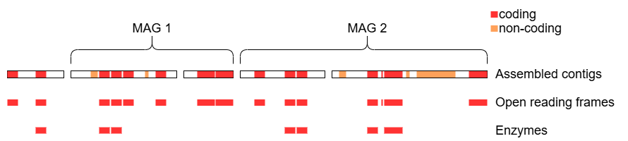

# Module 3 - Lab practical

In this lab, we will predict and briefly examine the functions encoded in the assembled metagenome from the previous labs.
All instructions required to completed this lab are provided below, so you are free to work asynchronously at your own pace.
Active discussions with both peers and instructors are encouraged.

## Setting up the workspace

Before we begin, this section will guide you through the set up of your workspace and compute environment.
The software tools used in this lab all have dependencies that must be installed separately.
Constructing the environment for each tool is non-trivial and error-prone.
The difficulty of replicating compute environments for bioinformatics software is one of the key contributing factors
to the reproducibility crisis [1].

We will instead be using prepackaged compute environments called "containers", implemented by Apptainer (formerly Singularity) [2].
One of these containers will enable the use of jupyter notebooks along with a collection of utilities.

#### Steps for setup:


1. Open an additional port via SSH for the new jupyter notebook
1. Create a new workspace directory for this lab
1. Unpack and start the container
1. Open the jupyter notebook in your browser

#### References

1.	Mangul S, Martin LS, Eskin E, Blekhman R. Improving the usability and archival stability of bioinformatics software. Genome Biol. 2019;20(1):47. doi:10.1186/s13059-019-1649-8
2.	Kurtzer GM, Sochat V, Bauer MW. Singularity: Scientific containers for mobility of compute. PLOS ONE. 2017;12(5):e0177459. doi:10.1371/journal.pone.0177459

### SSH port forwarding

#### Terminal (Unix/MacOS)

Add `-L 48888:localhost:48888` to the SSH command you use to connect to the server. For example:
```{bash, eval=FALSE, attr.source='.numberLines'}
ssh -L 48888:localhost:48888 ubuntu@main.uhn-hpc.ca -i ${path_to_your_key}
```
This means port `48888` on the remote server will be forwarded to your machine at `localhost:48888`.

#### Putty (Windows)

Modern versions of Windows should have `ssh` available through Powershell. Putty is available as a backup.


### Workspace

Create a new workspace in your home directory.

```{bash, eval=FALSE}
cd ~
mkdir amb_lab3
cd amb_lab3
```

Link the resource folder for easy access.

```{bash, eval=FALSE}
ln -s ~/CourseData/MIC_data/amb_module3/ ./lib
```

### Start container

Most containers for this lab were obtained from the biocontainers project, which provides a large collection of bioinformatics software in a standard format.
For each tool, we will provide URIs for the the specific container image used and where to get future versions.
The `pull` command of `apptainer` can be used to download images https://apptainer.org/docs/user/main/cli/apptainer_pull.html.

Here is an example which downloads `prodigal` as the container image `example.sif` from `docker://quay.io/biocontainers/prodigal:2.6.3--h7b50bb2_10`.
The image URI takes the form of `<protocol>://<address>:<tag>`. Tags are used to identify versions https://quay.io/repository/biocontainers/prodigal?tab=tags.

```{python, eval=FALSE, attr.source='.numberLines'}
apptainer pull example.sif docker://quay.io/biocontainers/prodigal:2.6.3--h7b50bb2_10
```
We can now run the prodigal executable inside the container using `exec` (execute) like so.

```{bash, eval=FALSE}
apptainer exec ./example.sif prodigal -h
```

All containers for this lab were pre-downloaded in the `./lib` directory, including a main container with Jupyter and miscellaneous utilities.

```{bash, eval=FALSE}
apptainer exec ./lib/amb_lab3.sif unpack
```

The following will dedicate the current terminal to running the juptyer notebook on port 48888.
You may want to connect another terminal to maintain terminal access.
```{bash, eval=FALSE}
start_lab
```

### Jupyter

JupyterLab should now be accessible at http://localhost:48888/lab. Create a new python notebook and import dependencies.

```{python, eval=FALSE, attr.source='.numberLines'}
import os, sys
import pandas as pd

from pathlib import Path
from local.ipc import Shell

LIB = Path("./lib")
```

A special `Shell` function is provided to access the terminal outside the container.
We can not run the container for another tool inside this container.

```{python, eval=FALSE, attr.source='.numberLines'}
Shell(f"""
pwd -P
echo {LIB}
""")
```

Triple quotes allows multi-line strings. The `f` enables the evaluation of python variables in the string.
For example, `f"echo {LIB}"` evaluates to `echo ./lib`.

## Overview

This lab will guide you through finding and identifying the functional units
(represented by the red and orange features below) of a metagenomic assembly, with a focus on proteins and enzymes.



We will begin by exploring techniques related to sequence similarity, which seeks to identify known genes through comparison with reference databases.

* [Prodigal]
* [Diamond]
* [Bakta]
* [Resistance Gene Identifier (RGI)]

Then we will transition to machine-learning tools, which move away from "lookup table" approach.

* [Kofamscan]
* [deepFRI]
* [deepEC]
* [proteinBERT]

Finally, we will use gapseq to construct toy metabolic models using techniques to predict the existence of enzymes.

* [gapseq]

## Prodigal

Containers are used to preserve the long-term executability of software tools used for this lab.

https://quay.io/repository/biocontainers/prodigal?tab=tags
```{python, eval=FALSE, attr.source='.numberLines'}
# docker://quay.io/biocontainers/prodigal:2.6.3--h7b50bb2_10
prodigal_sif = LIB/"prodigal.sif"
```

All containers for this lab 
To obtain a container with apptainer, we can use the pull command.

```{python, eval=FALSE, attr.source='.numberLines'}
# docker://quay.io/biocontainers/prodigal:2.6.3--h7b50bb2_10
prodigal_sif = LIB/"prodigal.sif"
```

```{python, eval=FALSE, attr.source='.numberLines'}
# docker://quay.io/biocontainers/prodigal:2.6.3--h7b50bb2_10
prodigal_sif = LIB/"prodigal.sif"
```

```{python, eval=FALSE, attr.source='.numberLines'}
Shell(f"apptainer exec {prodigal_sif} prodigal -h")
```

```{python, eval=FALSE, attr.source='.numberLines'}
Shell(f"""
mkdir -p prodigal_out
apptainer exec {prodigal_sif} \
    prodigal \
        -i /data/inputs/mg1655.fna \
        -a ./prodigal_out/mg1655.faa \
        -d ./prodigal_out/mg1655.fna \
        -f gff \
        -o ./prodigal_out/mg1655.gff
""")
```

## Sequence similarity

### Diamond

https://quay.io/repository/biocontainers/diamond?tab=tags
```{python, eval=FALSE, attr.source='.numberLines'}
# docker://quay.io/biocontainers/diamond:2.1.11--h5ca1c30_2
diamond_sif = LIB/"diamond.sif"
```

```{python, eval=FALSE, attr.source='.numberLines'}
Shell(f"apptainer exec {diamond_sif} diamond --help")
```

- https://www.tcdb.org/public/tcdb
- https://www.tcdb.org/cgi-bin/substrates/getSubstrates.py
- https://www.tcdb.org/cgi-bin/substrates/listSuperfamilies.py
- https://www.tcdb.org/cgi-bin/projectv/public/families.py

```{python, eval=FALSE, attr.source='.numberLines'}
transporter_db = DATA/"lib/transporter_classification_db"
```

```{python, eval=FALSE, attr.source='.numberLines'}
transporter_dmdb = transporter_db/"tcdb.dmnd"
if not transporter_dmdb.exists():
    Shell(f"""
    apptainer exec {diamond_sif} diamond makedb \
        --threads {CPUS} \
        --in /data/lib/{transporter_db.name}/tcdb.faa \
        --db /data/lib/{transporter_db.name}/tcdb
    """)
```

**TODO**
```{python, eval=FALSE, attr.source='.numberLines'}
Shell(f"""
apptainer exec {diamond_sif} \
    diamond blastp \
        --threads {CPUS} \

""")
```

### Bakta

https://quay.io/repository/biocontainers/bakta?tab=tags
```{python, eval=FALSE, attr.source='.numberLines'}
# docker://quay.io/biocontainers/bakta:1.9.4--pyhdfd78af_0
bakta_sif = LIB/"diamond.sif"
```

```{python, eval=FALSE, attr.source='.numberLines'}
Shell(f"apptainer exec {bakta_sif} bakta --help")
```

```{python, eval=FALSE, attr.source='.numberLines'}
Shell(f"apptainer exec {bakta_sif} bakta_db list")
```

```{python, eval=FALSE, attr.source='.numberLines'}
# bakta_db = LIB/"bakta_db/db"        # 2 hours
bakta_db = LIB/"bakta_db/db-light"  # 30 mins
if not bakta_db.exists():
    if "light" in str(bakta_db):
        _type = "light"
    else:
        _type = "full"
    Shell(f"apptainer exec {bakta_sif} bakta_db download --output {bakta_db} --type {_type}")
```

meta 

```{python, eval=FALSE, attr.source='.numberLines'}
Shell(f"""
apptainer exec {bakta_sif} \
    bakta --meta --threads {CPUS} --force --skip-plot \
        --db {bakta_db} \
        --output ./outputs/bakta.chicken \
        /home/tony/workspace/projects/AMB_2025/data/inputs/final.contigs.fa
""")
```

### Resistance Gene Identifier (RGI)

https://quay.io/repository/biocontainers/rgi?tab=tags
```{python, eval=FALSE, attr.source='.numberLines'}
# docker://quay.io/biocontainers/rgi:6.0.4--pyh05cac1d_0
rgi_sif = LIB/"rgi.sif"
```

```{python, eval=FALSE, attr.source='.numberLines'}
Shell(f"apptainer exec {rgi_sif} rgi --help")
```

It looks like RGI accepts different commands (`usage: rgi <command> [<args>]`) and `main` seems to be the one that generates annotations.

```{python, eval=FALSE, attr.source='.numberLines'}
Shell(f"apptainer exec {rgi_sif} rgi main --help")
```

- RGI is a bit picky and doesn't provide any indication of progress or successful completion.
- Tackle the errors in the order in which they appear until you get a successful run, which should take no more than 1 min.
- Don't worry about the `SyntaxWarning` since it looks like a typo in the source code that doesn't otherwise impact the execution of the tool.

<details>
    <summary>Hint 1</summary>

        Consider the inputs and outputs
        
</details>

<details>
    <summary>Hint 2</summary>

        -i -o -t
        
</details>

<details>
    <summary>Hint <code>Read-only file system</code></summary>

        -i -o -t
        
</details>

<details>
    <summary>Answer</summary>

```{python, eval=FALSE, attr.source='.numberLines'}
Shell(f"""
mkdir -p ./outputs/rgi
apptainer exec -B ./cache:/usr/local/lib/python3.12/site-packages/app/_db {rgi_sif} \
    rgi main --num_threads {CPUS} \
        -i ./outputs/bakta_light/mg1655.faa \
        -t protein \
        -o ./outputs/rgi/mg1655
""")
```

</details>

Stub:
```{python, eval=FALSE, attr.source='.numberLines'}
Shell(f"""
# your solution here
""")
```
## Machine learning

### Kofamscan

https://quay.io/repository/hallamlab/external_kofamscan?tab=tags
```{python, eval=FALSE, attr.source='.numberLines'}
# docker://quay.io/hallamlab/external_kofamscan:1.3.0
kofamscan_sif = LIB/"kofamscan.sif"
```

```{python, eval=FALSE, attr.source='.numberLines'}
Shell(f"apptainer exec {kofamscan_sif} kofamscan --help")
```

https://www.genome.jp/ftp/tools/kofam_scan/README.md

```{python, eval=FALSE, attr.source='.numberLines'}
Shell(f"apptainer exec {kofamscan_sif} exec_annotation --help")
```

- `ftp://ftp.genome.jp/pub/db/kofam/ko_list.gz`
- `ftp://ftp.genome.jp/pub/db/kofam/profiles.tar.gz`

```{python, eval=FALSE, attr.source='.numberLines'}
# about 12 mins
Shell(f"""
mkdir -p ./outputs/kofamscan
apptainer exec {kofamscan_sif} \
    exec_annotation \
        --cpu={CPUS} --format=detail --no-report-unannotated \
        --profile=/data/lib/kofamscan_db/profiles/prokaryote.hal --ko-list=/data/lib//kofamscan_db/ko_list \
        -o ./outputs/kofamscan/chicken.out \
        ./outputs/bakta.chicken/final.contigs.faa
""")
```


```{python, eval=FALSE, attr.source='.numberLines'}
from local.models.kegg_orthology import ParseKofamScanResults

model = ParseKofamScanResults(
    Path("/home/tony/workspace/projects/AMB_2025/main/amb_lab3/scratch/mock/outputs/kofamscan/chicken.out"),
    Path("/home/tony/workspace/projects/AMB_2025/data/lib/kofamscan_db/api_kegg.db"),
    Path("/home/tony/workspace/projects/AMB_2025/data/lib/kofamscan_db/brite.json"),
)
```

### deepFRI

https://quay.io/repository/hallamlab/external_deepfri?tab=tags
```{python, eval=FALSE, attr.source='.numberLines'}
# docker://quay.io/hallamlab/external_deepfri:1.0.1
deepfri_sif = LIB/"deepfri.sif"
```

```{python, eval=FALSE, attr.source='.numberLines'}
Shell(f"""
apptainer exec {deepfri_sif} \
    deepfri \
        --ont mf bp ec \
        --fasta_fn ./outputs/bakta.chicken/final.contigs.faa \
        --output_fn_prefix ./outputs/deepfri 
""")
```

### deepEC

https://quay.io/repository/hallamlab/external_deepec?tab=tags
```{python, eval=FALSE, attr.source='.numberLines'}
# docker://quay.io/hallamlab/external_deepec:0.4.1
deepec_sif = LIB/"deepec.sif"
```

**TODO**

### proteinBERT

https://quay.io/repository/hallamlab/external_proteinbert?tab=tags
```{python, eval=FALSE, attr.source='.numberLines'}
# docker://quay.io/hallamlab/external_proteinbert:2024.03.28
proteinbert_sif = LIB/"proteinbert.sif"
```

**TODO**

## Metabolic modelling

### gapseq

https://quay.io/repository/biocontainers/gapseq?tab=tags
```{python, eval=FALSE, attr.source='.numberLines'}
# docker://quay.io/biocontainers/gapseq:1.4.0--h9ee0642_1
gapseqt_sif = LIB/"gapseq.sif"
```

```{python, eval=FALSE, attr.source='.numberLines'}
Shell(f"""
mkdir -p ./outputs/gapseq/
rm ./outputs/gapseq/mg1655.*
apptainer exec {gapseq_sif} \
    gapseq find -p glycolysis -l KEGG -K 14 -O -f ./outputs/gapseq/mg1655 ./outputs/bakta_light/mg1655.faa \
        > ./outputs/gapseq/mg1655.out 2> ./outputs/gapseq/mg1655.err
""")
```

```{python, eval=FALSE, attr.source='.numberLines'}
Shell(f"""
rm ./outputs/gapseq/mg1655.tr*
apptainer exec {gapseq_sif} \
    gapseq find-transport -K 14 -f ./outputs/gapseq/mg1655 ./outputs/bakta_light/mg1655.faa \
        > ./outputs/gapseq/mg1655.trout 2> ./outputs/gapseq/mg1655.trerr
""")
```

```{python, eval=FALSE, attr.source='.numberLines'}
Shell(f"""
apptainer exec {gapseq_sif} \
    gapseq draft \
        -r ./outputs/gapseq/mg1655/mg1655-glycolysis-Reactions.tbl \
        -p ./outputs/gapseq/mg1655/mg1655-glycolysis-Pathways.tbl \
        -t ./outputs/gapseq/mg1655/mg1655-Transporter.tbl \
        -c ./outputs/bakta_light/mg1655.faa \
        -f ./outputs/gapseq/mg1655
""")
```

```{python, eval=FALSE, attr.source='.numberLines'}
Shell(f"""
apptainer exec {gapseq_sif} \
    gapseq fill --quick.gf \
        -m ./outputs/gapseq/mg1655/mg1655-draft.RDS \
        -n ./outputs/gapseq/mg1655/m9.csv \
        --output.dir ./outputs/gapseq/mg1655
""")
```

**TODO:** kegg mapper
look at what reactions were filled

