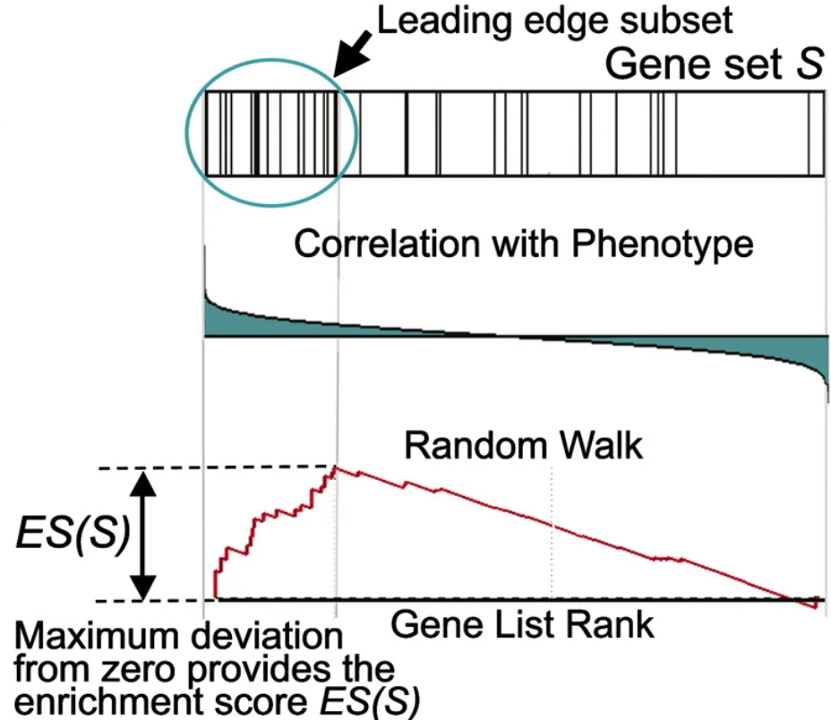
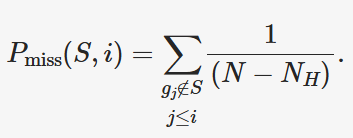
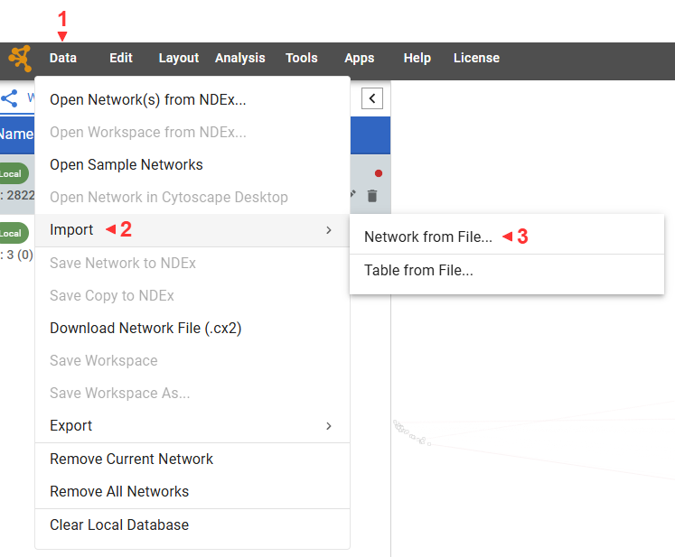
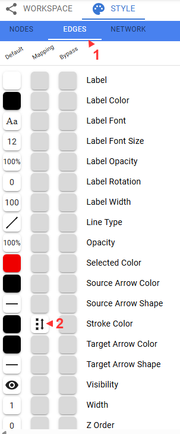
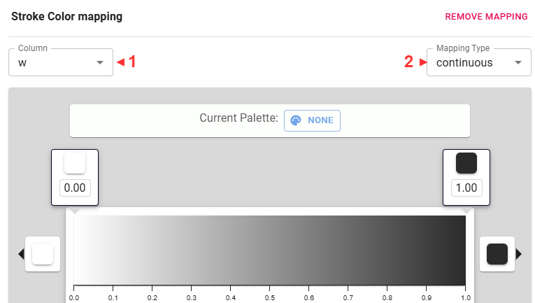

# Module 4: Visualization and Finding Functional Significance

## Lecture

<iframe width="640" height="360" src="https://docs.google.com/presentation/d/1O0OXV6T6qxyzz66eoYKZEtY4H8JqrxIF/preview" title="YouTube video player" frameborder="0" allow="accelerometer; autoplay; clipboard-write; encrypted-media; gyroscope; picture-in-picture; web-share" referrerpolicy="strict-origin-when-cross-origin" allowfullscreen></iframe>


## Lab

This tutorial is part of the 2025 CBW [Advanced Microbiome Analysis](https://bioinformaticsdotca.github.io/AMB_2025/) (held in Vancouver, BC, May 29-30).

Author: Tony Liu

---

In this lab, we will work through typical transcriptiomic analyses to find significantly expressed genes
and gene sets. Metagenomic reads will be used in place of transcriptomic data, so we will be examining
abundance instead of expression, but the analyses shown will remain unchanged.
For the sake of consistency, the abundance data will be referred to "expression" for the rest of the lab.

### Setting up the workspace

The following procedure is near identical to that of lab3.
[Please refer to the setup sectiom of lab3 for justifications and context.](module-3---lab-practical.html#setting-up-the-workspace)
We will need to perform the following steps:

1. Open an additional port via SSH for the new jupyter notebook
1. Create a new workspace directory for this lab
1. Unpack and start the container
1. Open the jupyter notebook in your browser

#### SSH port forwarding

##### Terminal (Unix/MacOS)

Add `-L 48888:localhost:48888` to the SSH command you use to connect to the server. Something like:
```{bash, eval=FALSE, attr.source='.numberLines'}
ssh -L 48888:localhost:48888 ubuntu@##.uhn-hpc.ca -i CBW.pem
```
##### Putty (Windows)


#### Workspace

Let's create a new workspace for this lab.

```{bash, eval=FALSE}
cd ~/workspace
mkdir amb_module4
cd amb_module4
```

Link the resource folder for easy access.

```{bash, eval=FALSE}
ln -s ~/CourseData/MIC_data/amb_module4/ ./lib
```

The expected outputs for this lab can be found in `./lib/outputs`.
```{bash, eval=FALSE}
ls ./lib/outputs
```

#### Start container

Unpack the main container for this lab (https://quay.io/repository/hallamlab/cbw_amb_lab4?tab=tags).
```{bash, eval=FALSE}
apptainer exec -B /media:/media ./lib/amb_lab4.sif unpack
```

The following will dedicate the current terminal to running the juptyer notebook on port 48888.
You may want to connect another terminal to maintain terminal access.
```{bash, eval=FALSE}
./start_lab
```

#### Jupyter

JupyterLab should now be accessible at http://localhost:48888/lab. Create a new python notebook and import dependencies.
```{python, eval=FALSE, attr.source='.numberLines'}
import os
import pandas as pd
from pathlib import Path

LIB = Path("./lib")
CPUS = 4 # your workshop instance has been alloted 4 cores
```

All software tools are packaged in the main container, so we can use `os.system("...")` instead of `Shell`.
```{python, eval=FALSE, attr.source='.numberLines'}
os.system(f"""
pwd -P
echo {LIB}
""")
```

### Overview

To understand the objective of this lab, let's first have a look at the metadata.
```{python, eval=FALSE, attr.source='.numberLines'}
df_meta = pd.read_csv(LIB/"inputs/metagenome_metadata.txt", sep="\t")
print(df_meta.shape)
df_meta.head(2)
```
<details>
    <summary>How many samples and how many categories?</summary>

We have 33 samples divided into "Bacteroides" and "Non-Bacteroides" groups.
        
</details>

We also have a set of predicted genes.
```{python, eval=FALSE, attr.source='.numberLines'}
from Bio import SeqIO

count = 0
genes_fasta = LIB/"inputs/lab3_orfs.fna"
for i, sequence in enumerate(SeqIO.parse(genes_fasta, "fasta")):
    count += 1
count
```

The objective of this lab is to identify and visualize the pathways who's gene expression patterns correlate with the Bacteroides vs Non-Bacteroides grouping.
To do this we will:

1. Use [salmon](Salmon) to obtain a count matrix representing the expression level of each gene in each sample. 
1. Use [deseq2](DESeq2) to identify significantly expressed genes and generate a null distribution for gene set enrichment analysis.
1. Perform [Gene set enrichment analysis (GSEA)](gene-set-enrichment-analysis-gsea) to identify significantly enriched pathways.
1. Visualize the metabolic network in [cytoscape](Cytoscape) with expression information.

### Salmon

The alignment of transcriptomic reads to genes is often ambiguous. A single read can map to multiple genes and the length of genes compared to reads
means that multiple reads will map to different regions of the same gene. Salmon uses probabilistic and statistical models to quantify the expression of
each gene while also addressing potential biases [1]. We will use salmon to obtain a count matrix for deseq2.

1. Patro R, Duggal G, Love MI, Irizarry RA, Kingsford C. Salmon provides fast and bias-aware quantification of transcript expression. Nat Methods. 2017;14(4):417–9. https://doi.org/10.1038/nmeth.4197

Let's have a look at the help message.
```{python, eval=FALSE, attr.source='.numberLines'}
os.system(f"salmon --help")
```

```{python, eval=FALSE, attr.source='.numberLines'}
os.system(f"salmon index --help")
```

```{python, eval=FALSE, attr.source='.numberLines'}
os.system(f"salmon quant --help")
```

We will need to index the reference genes before performing quantification.
```{python, eval=FALSE, attr.source='.numberLines'}
salmon_dir = Path("./salmon")
genes_fasta = LIB/"inputs/lab3_orfs.fna"
salmon_index = salmon_dir/"index"
os.system(f"salmon index -t {genes_fasta} -i {salmon_index}")
```

**Quantification will take about 20 minutes. Do not run.** `tqdm` is a used to display a progress bar.
Precomputed outputs are at `./lib/outputs/salmon/`.
```{python, eval=FALSE, attr.source='.numberLines'}
from tqdm import tqdm

reads_dir = LIB/"inputs/reads"
samples = list(reads_dir.iterdir())
for read_file in tqdm(samples, total=len(samples)):
    srr = read_file.name.split("_")[0]
    out = salmon_dir/f"{srr}"
    os.system(f"""
        mkdir -p {out}
        salmon quant \
            -l A \
            -p {CPUS} \
            -i {salmon_index} \
            -r {read_file} \
            -o {out} \
            >{out}/salmon.log 2>{out}/salmon.err
    """)
```

Salmon requires information about the reads' library type, such as stranded, unstranded, facing, paired-end, etc. `-l A` will tell Salmon to infer the type
from the first 1000 reads. [More information is here.](https://salmon.readthedocs.io/en/latest/salmon.html#what-s-this-libtype)

Let's have a look at one of the results. The file we want is `quant.sf`.
```{python, eval=FALSE, attr.source='.numberLines'}
salmon_dir = LIB/"outputs/salmon/" # divert
for srr in salmon_dir.iterdir():
    if not srr.name.startswith("SRR"): continue
    df = pd.read_csv(srr/"quant.sf", sep="\t")
    break
df
```

The `TPM` (transcipts per million) column is useful on its own, but deseq2 prefers raw counts, so we will use the `NumReads` column.
Let's create the count matrix of genes by samples. First, create an index of genes.
```{python, eval=FALSE, attr.source='.numberLines'}
gene2i = {}
for i, sequence in enumerate(SeqIO.parse(genes_fasta, "fasta")):
    gene2i[sequence.id] = i
len(gene2i)
```

Now, we will load the counts for each sample into the matrix by matching the gene name using the index.

<details>
    <summary>What are the expected dimensions of the count matrix?</summary>

Genes x Samples, so 3298 x 33.

---

</details>

```{python, eval=FALSE, attr.source='.numberLines'}
import numpy as np

mtx = np.zeros(shape=(len(gene2i), len(samples)), dtype=np.int32) # genes x samples
for i, srr in tqdm(enumerate(df_meta["sample_name"]), total=len(df_meta)):
    df = pd.read_csv(salmon_dir/f"{srr}/quant.sf", sep="\t")

    gene_indexes = [gene2i[row["Name"]] for _, row in df.iterrows()]
    counts = df["NumReads"]
    mtx[gene_indexes, i] = counts
mtx.shape
```

Finally, we will label the rows and columns of the matrix with gene IDs and sample names before saving it to a file.
```{python, eval=FALSE, attr.source='.numberLines'}
gene_ids = list(gene2i.keys())
sample_ids = list(df_meta["sample_name"])

df = pd.DataFrame(mtx, columns=sample_ids)
df["gene_id"] = gene_ids
df = df.set_index("gene_id")
print(df.shape)
df.to_csv("./salmon/counts.mtx")
df.head(2)
```

We are now ready for deseq2.

### DESeq2

DESeq2 is a statistical package for R that is used to analyze count data from RNA-Seq experiments [1].
It uses a negative binomial distribution to model count data, taking into account large biological diversity and technical noise
(overdispersion). We will use the statistical models and tools provided by DESeq2 to calculate fold changes and estimate significance.
The main purpose of DESeq2 in this lab is to generate the needed data for GSEA, which includes estimating the correlation between
gene expression and the experimental groups: Bacteroides and Non-Bacteroides. We will also generate a null distribution for
GSEA by permuting the sample labels.

1. Patro R, Duggal G, Love MI, Irizarry RA, Kingsford C. Salmon provides fast and bias-aware quantification of transcript expression. Nat Methods. 2017;14(4):417–9. https://doi.org/10.1038/nmeth.4197

**Transistion to an R notebook.** Click on the `+` and select "R" under Notebook.


```{R, eval=FALSE, attr.source='.numberLines'}
library(DESeq2)
library(readr)
```

load the count matrix
```{R, eval=FALSE, attr.source='.numberLines'}
cts <- as.matrix(read.csv(
    "./salmon/counts.mtx",
    row.names = "gene_id"
))
cts
```

load the sample metadata
```{R, eval=FALSE, attr.source='.numberLines'}
coldata <- read.csv(
    "./lib/inputs/metagenome_metadata.txt",
    sep = "\t",
)
coldata$grouping
```

Create a Deseq dataset object.
```{R, eval=FALSE, attr.source='.numberLines'}
dds <- DESeqDataSetFromMatrix(
  countData = cts,
  colData = coldata,
  design = ~ grouping
)
dds
```

This is how we would run DESeq2, but don't run it just yet.
```{R, eval=FALSE, attr.source='.numberLines'}
dds <- DESeq(dds)
```

We can cache the results to an "R data serialized" (RDS) to prevent having to re-run this analysis when restarting the notebook.
```{R, eval=FALSE, attr.source='.numberLines'}
deseq_save <- "./deseq2/dds.rds"
if (!file.exists(deseq_save)) {
  dds <- DESeq(dds)
  dir.create("./deseq2", showWarnings = TRUE) # create the directory if it doesn't exist
  saveRDS(dds, deseq_save)
} else {
  dds <- readRDS(deseq_save)
}
```

Extract the results and save to a dataframe. This will contain log2 fold changes and p-values for each gene.
```{R, eval=FALSE, attr.source='.numberLines'}
res <- results(dds, contrast = c("grouping", "Bacteroides", "Non-Bacteroides"))
results_table <- as.data.frame(res)
write.csv(results_table, "./deseq2/results.csv", row.names = TRUE)
results_table
```

Next, we will compute the correlation between gene expression and the experimental groups and generate a null distribution for GSEA
by permuting the sample labels. This effectively randomizes the assignemnt of samples
to each experimental condition, but preserves any relationships between genes within a single sample.
When the number of samples is low, genes can be randomly assigned to gene sets instead, but this fails to take into account gene-gene relationships.
The p-value is estimated as the fraction of null samples that have a GSEA score greater than or equal to the observed GSEA score.

<details>
    <summary>What is the minimum number of samples to simulate a null distribution with a precision of at least 0.05?</summary>

4 samples (4! = 24, 1/24 is about 0.04).

---

</details>
<br>

We will use the suggested variance stablized transform (VST) to obtain normalized counts. VST removes the dependence of variance on the mean,
which limits the high variance of the logarithm of counts when the mean is low.
([more info here](https://bioconductor.org/packages/devel/bioc/vignettes/DESeq2/inst/doc/DESeq2.html#:~:text=transformations%20and%20visualization-,Count%20data%20transformations,-In%20order%20to)).
```{R, eval=FALSE, attr.source='.numberLines'}
vst <- vst(dds, blind = FALSE)
vst_counts <- assay(vst)
vst_counts
```

The human-readable class labels need to be converted to more machine-friendly ordinal labels.
```{R, eval=FALSE, attr.source='.numberLines'}
coldata$grouping
class_labels_ordinal <- 1 - (as.numeric(factor(coldata$grouping)) - 1)
class_labels_ordinal
```

We will use the point biserial correlation, a special case of the Pearson correlation designed to compare a continuous variable with a binary variable.
Alternatively the biserial correlation achieves nearly the same, but assumes that the binary variable is the result of thresholding a continuous variable.
For example, it would be appropriate to use the point biserial correlation for a coin toss, while the biserial correlation would be more appropriate for pass/fails from percentage grades.
Practically, the biserial correlation also requires the relative propotions of each class. While there likely is a genetic spectrum of bacteria spanning
from Bacteroides to Non-Bacteroides, we don't have any information on this spectrum or the genetic threshold at which an organism stops being a Bacteroides.

```{R, eval=FALSE, attr.source='.numberLines'}
point_biserial <- function(expression, classes) {
  if (sd(expression) == 0) return(NA)
  return(cor(expression, classes, method = "pearson"))
}
```

Estimate the observed correlation.
```{R, eval=FALSE, attr.source='.numberLines'}
gene_correlations <- apply(vst_counts, 1, point_biserial, classes = class_labels_ordinal)
gene_correlations <- as.data.frame(gene_correlations)
write.csv(gene_correlations, "./deseq2/gene_correlations.csv", row.names = TRUE)
```

To generate the null distribution, we will be taking many samples (200). The following libraries will enable us to parallelize the computation.
```{R, eval=FALSE, attr.source='.numberLines'}
library(pbapply)
library(parallel)
```

Since this is computationally expensive, we will use the caching technique shown earlier.
```{R, eval=FALSE, attr.source='.numberLines'}
null_save <- "./deseq2/null_distr.csv"

if (!file.exists(null_save)) {

  tryCatch(             # if anything goes wrong, we must run the "finally" block
    {
      cl <- makeCluster(4) # make a cluster with 4 workers
      # make these variables available to each worker
      clusterExport(cl, c("vst_counts", "point_biserial", "class_labels_ordinal"))

      n_permutations <- 200
      permutation_results <- pbsapply(
        1:n_permutations,   # iterate 200 times
        function(i) {       # and run this function each time
          # Shuffle labels
          n <- length(class_labels_ordinal)
          shuffled_labels <- sample(class_labels_ordinal, size = n, replace = FALSE)

          # Calculate correlations for all genes
          return(apply(vst_counts, 1, point_biserial, classes = shuffled_labels))
        },
        cl = cl # use workers to compute in parallel
      )
    },
    finally = {         # no matter what happens
      stopCluster(cl)   # remember to stop the cluster
    }
  )

  # cache results as a dataframe
  null_distr <- data.frame(
    sample = permutation_results,
    stringsAsFactors = FALSE
  )
  write.csv(
    null_distr,
    null_save,
    row.names = TRUE
  )
} else {
  null_distr <- read.csv(null_save)
}

dim(null_distr)
```

### Gene set enrichment analysis (GSEA)

**Back to python.**

GSEA ranks genes by their correlation with experimental groups, then examines the overrepresentation of gene sets in highly ranked genes by calculating an
enrichment score (ES) [1]. The observed ES compared to the null distribution of enrichment scores is then used to estimate the significance of the observed ES.
To apply GSEA, we need:

- N samples where M continuous features are measured (eg. N transcriptomic samples for M genes, N metagenomes of M members, N pictures of M pixels, etc.)
- Groupings (overlap permitted) of these M features to test

Despite GSEA being widely applicable, implementations are overly specific to human transcriptomics, rendering them difficult to adapt to even adjacent domains.
Fortunately, the technique itself is rather straightforward to implement.

1. Patro R, Duggal G, Love MI, Irizarry RA, Kingsford C. Salmon provides fast and bias-aware quantification of transcript expression. Nat Methods. 2017;14(4):417–9. https://doi.org/10.1038/nmeth.4197

We will use KEGG pathways as our gene sets. These were predicted using Kofamscan from the previous lab.
```{python, eval=FALSE, attr.source='.numberLines'}
from local.models.kegg_orthology import ParseKofamScanResults

kegg_model = ParseKofamScanResults(
    LIB/"inputs/kofamscan/kos.out",
    LIB/"kofamscan_db/api_kegg.db",
    LIB/"kofamscan_db/brite.json",
)
```

We will find the pathways for each gene by tracing: `gene -> function -> reaction -> pathway`.
```{python, eval=FALSE, attr.source='.numberLines'}
function2genes = {}
for _, r in kegg_model.df.iterrows():
    ko = r["ko"]
    orf = r["orf"]
    function2genes[ko] = function2genes.get(ko, set())|{orf}

reactions2functions = {}
for ko in function2genes:
    meta = kegg_model.Functions[ko]
    for r in meta.reactions:
        reactions2functions[r] = reactions2functions.get(r, set())|{ko}

pathway2reactions = {}
for r in reactions2functions:
    meta = kegg_model.Reactions[r]
    for p in meta.pathways:
        pathway2reactions[p] = pathway2reactions.get(p, set())|{r}

gene_sets = {} # collect the genes for each pathway
for p, reactions in pathway2reactions.items():
    genes = set()
    for r in reactions:
        functions = reactions2functions[r]
        for f in functions:
            genes |= function2genes[f]
    gene_sets[p] = genes
```

Load correlations from DESeq2.
```{python, eval=FALSE, attr.source='.numberLines'}
deseq_dir = Path("./deseq2")
df_null = pd.read_csv(deseq_dir/"null_distr.csv", index_col=0)
print(df_null.shape)
df_null.head(2)
```

```{python, eval=FALSE, attr.source='.numberLines'}
df_corr = pd.read_csv(deseq_dir/"gene_correlations.csv", index_col=0)
print(df_corr.shape)
df_corr.head(2)
```

Next we will calculate the ES and p-value for an example pathway `rn00983`.
```{python, eval=FALSE, attr.source='.numberLines'}
gene_set = gene_sets["rn00983"]
kegg_model.Pathways["rn00983"].name
```

First, create a matrix of permutations x genes, only taking those that are in gene sets.
```{python, eval=FALSE, attr.source='.numberLines'}
enzymes = {x for g in gene_sets.values() for x in g}
def _only_enzymes(df: pd.DataFrame):
    return df.loc[df.index.isin(enzymes)]

corr = _only_enzymes(df_corr).to_numpy()
permuted = _only_enzymes(df_null).to_numpy()
mat = np.hstack([corr, permuted]) # true correlations is the first permutation
mat.shape
```

Rank order the genes in each permutation by their correlation.
```{python, eval=FALSE, attr.source='.numberLines'}
mat_index = np.argsort(-mat.T, stable=True)
mat_sorted = np.zeros_like(mat)
for i, order in enumerate(mat_index):
    mat_sorted[:, i] = mat[:, i][order]
mat_sorted.shape
```

Let's make a human-readable list of genes so we know what each position of the matrix corresponds to.
Notice how the length of labels corresponds to the genes axis of the matrix.
```{python, eval=FALSE, attr.source='.numberLines'}
labels = _only_enzymes(df_corr).index.to_numpy()
len(labels)
```

#### (Optional: implementing GSEA)

This section dives deep into python to implement GSEA from scratch. 
It is often sufficient to use existing software, but especially new or domain specific algorithms may be more difficult to install
than implementing from scratch. Sometimes installation or implementation are both difficult...
Our ultimate goal is to create this plot from figure 1 of the GSEA paper [1]

{width=50%}

To calculate the ES, a running sum is calculated by scanning down the ranked list of genes, increasing the score for genes that
are in the gene set and decreasing it otherwise. Genes in the gene set are called "hits" and those not in the gene set are called "misses".
The magnitude of the increase is dependent on the correlation between the gene
expression and the experimental grouping. The ES is the maximum deviation from 0 of this running sum statistic, caused by the commulative effect
of the genes ranked before the maximum deviation is reached ("leading edge subset").

The running sum statistic is calculated as the difference between the effect of hits and misses.
The equation for the running sum of hits (P_hit) at rank _i_
for gene set _S_ is given in the paper. Don't look at all of it at once, we will break it down.
First, note that the summations only consider genes in the gene set _S_.


Let's create a mask to select only genes in _S_.
```{python, eval=FALSE, attr.source='.numberLines'}
S = np.array([k in gene_set for k in labels], dtype=int) # g in S
S = S[mat_index.T] # same order as mat
```

Next, have a look at N<sub>R</sub>. r<sub>j</sub> is simply the correlation values of each gene. _p_ is a hyperparamter set to 1.
Let's calculate N<sub>R</sub>.
```{python, eval=FALSE, attr.source='.numberLines'}
p = 1
corr = np.pow(np.abs(mat_sorted), p)
N_R = np.sum(corr*S, axis=0)
```

We now need to combine the repeated |r<sub>j</sub>|<sup>p</sup> term in the numerator with 
N<sub>R</sub> in the denominator and cumulatively sum up to each gene. `np.cumsum()` does this for us.
```{python, eval=FALSE, attr.source='.numberLines'}
P_hit = corr/N_R
P_hit = P_hit*S # g_j in S
P_hit = np.cumsum(P_hit, axis=0)
```

Have a look.
```{python, eval=FALSE, attr.source='.numberLines'}
from local.figures.template import BaseFigure, ApplyTemplate, go
fig = BaseFigure()
fig.add_trace(go.Scatter(
    x = np.arange(len(P_hit[:, 0])),
    y = P_hit[:, 0],
))
fig = ApplyTemplate(fig)
fig.show()
```

For P_miss, we cumulatively sum the fraction of misses.



```{python, eval=FALSE, attr.source='.numberLines'}
P_miss = 1/(len(labels) - len(gene_set))
_mask = 1-S.T # invert hits for misses
P_miss = np.ones_like(labels)*_mask*P_miss
P_miss = np.cumsum(P_miss.T, axis=0)
```

That's it, have a look.
```{python, eval=FALSE, attr.source='.numberLines'}
fig = BaseFigure()
fig.add_trace(go.Scatter(
    x = np.arange(len(P_miss[:, 0])),
    y = -P_miss[:, 0],
))
fig = ApplyTemplate(fig)
fig.show()
```

Now we combine P_hit and P_miss to get the running sum statistic
and find the maximum magnitude to report the enrichment score (ES).
```{python, eval=FALSE, attr.source='.numberLines'}
S_distr = (P_hit - P_miss).T # running statistic
ES_pos = S_distr.max(axis=1)
ES_neg = S_distr.min(axis=1)
ES_candidates = np.vstack([ES_pos, ES_neg]).T       # candidate is either the positive or negative
to_take = np.argmax(np.abs(ES_candidates), axis=1)  # we must select for each permutation
ES = (ES_neg*to_take) + (ES_pos*(1-to_take))
```

Have a look.
```{python, eval=FALSE, attr.source='.numberLines'}
fig = BaseFigure()
fig.add_trace(go.Scatter(
    x = np.arange(len(S_distr[0])),
    y = S_distr[0],
))
fig = ApplyTemplate(fig)
fig.show()
```

We can now split the score and null distribution and estimate the p-value.
```{python, eval=FALSE, attr.source='.numberLines'}
score, null = ES[0], ES[1:]
pvalue = np.sum(null >= score) / null.shape[0]
if pvalue == 0:
    pvalue = 1 / null.shape[0]
score, pvalue
```

<details>
    <summary>Why do we change the pvalue if it is equal to 0?</summary>

If the p-value is 0, then the resolution of the null distribution was insufficient. To be conservative, we set it to the
smallest pvalue that is resolvable, which is 1/(the sample size of the null distribution).

</details>
<br>

Let's clean things up a bit. We will encapsulate the procedure in a function and 
return a `dataclass`, which is just a convient way to organize a collection of variables.
We will use this function to run GSEA for each pathway. Try completing the `gsea()` function below.

```{python, eval=FALSE, attr.source='.numberLines'}
from dataclasses import dataclass

@dataclass
class GseaResult:
    set_name: str
    set_size: int
    score: float
    pvalue: float
    hits: np.ndarray
    running_sum_statistic: np.ndarray
    
def gsea(name):
    gene_set = gene_sets[name]
    
    # ...

    return GseaResult(
        set_name=name,
        set_size=len(gene_set),
        score=score,
        pvalue=pvalue,
        hits=S.T[0],
        running_sum_statistic=S_distr[0],
    )

res = gsea("rn00983")
res.score, res.pvalue
```

#### Running GSEA

<details>
    <summary>Solution</summary>

```{python, eval=FALSE, attr.source='.numberLines'}
from dataclasses import dataclass

@dataclass
class GseaResult:
    set_name: str
    set_size: int
    score: float
    pvalue: float
    hits: np.ndarray
    running_sum_statistic: np.ndarray
    
def gsea(name):
    gene_set = gene_sets[name]
    S = np.array([k in gene_set for k in labels], dtype=int) # g in S
    S = S[mat_index.T] # same order as mat

    p = 1
    corr = np.pow(np.abs(mat_sorted), p)
    N_R = np.sum(corr*S, axis=0)

    P_hit = corr/N_R
    P_hit = P_hit*S # g_j in S
    P_hit = np.cumsum(P_hit, axis=0)

    P_miss = 1/(len(labels) - len(gene_set))
    _mask = 1-S.T # invert hits for misses
    P_miss = np.ones_like(labels)*_mask*P_miss
    P_miss = np.cumsum(P_miss.T, axis=0)

    S_distr = (P_hit - P_miss).T # running statistic
    ES_pos = S_distr.max(axis=1)
    ES_neg = S_distr.min(axis=1)
    ES_candidates = np.vstack([ES_pos, ES_neg]).T       # candidate is either the positive or negative
    to_take = np.argmax(np.abs(ES_candidates), axis=1)  # we must select for each permutation
    ES = (ES_neg*to_take) + (ES_pos*(1-to_take))

    score, null = ES[0], ES[1:]
    pvalue = np.sum(null >= score) / null.shape[0]
    if pvalue == 0:
        pvalue = 1 / null.shape[0]

    return GseaResult(
        set_name=name,
        set_size=len(gene_set),
        score=score,
        pvalue=pvalue,
        hits=S.T[0],
        running_sum_statistic=S_distr[0],
    )

res = gsea("rn00983")
res.score, res.pvalue
```

---

</details>
<br>

We can now run GSEA for all pathways.
```{python, eval=FALSE, attr.source='.numberLines'}
results: list[GseaResult] = []
for k in tqdm(gene_sets, total=len(gene_sets)):
    res = gsea(k)
    results.append(res)
results_map = {r.set_name: r for r in results}
```

And print out some relavent results.
```{python, eval=FALSE, attr.source='.numberLines'}
results = sorted(results, key=lambda x: x.pvalue)
for r in results:
    if r.pvalue > 0.05: continue
    meta = kegg_model.Pathways[r.set_name]
    print(f"{r.pvalue:.2} {r.score:.2} {r.hits.sum()} {r.set_name}:{meta.name}")
```

Let's save the results to a table.
```{python, eval=FALSE, attr.source='.numberLines'}
rows = []
for res in results:
    rows.append((
        res.set_name,
        res.pvalue,
        res.score,
    ))

df_gsea = pd.DataFrame(rows, columns=["set_name", "pvalue", "score"])
Path("./gsea").mkdir(exist_ok=True, parents=True)
df_gsea.to_csv("./gsea/results.csv", index=False)
df_gsea
```

The nice GSEA plots shown in the paper are omposed of 3 elements.
First, we indicate the rank of genes within the selected gene set.
```{python, eval=FALSE, attr.source='.numberLines'}
from local.figures.colors import COLORS

res = results_map["rn00983"]

fig = BaseFigure()
_f = res.hits.astype(bool)
fig.add_trace(
    go.Scatter(
        x = np.arange(labels.shape[0])[_f],
        y = np.zeros_like(labels)[_f],
        mode = "markers",
        marker=dict(
            size=25,
            color=COLORS.TRANSPARENT,
            symbol="line-ns",
            line=dict(width=1),
        ),
        showlegend=False,
    ),
)
fig = ApplyTemplate(fig)
fig.show()
```

Next, we draw out the magnitudes of the correlations.
```{python, eval=FALSE, attr.source='.numberLines'}
fig = BaseFigure()
fig.add_trace(
    go.Bar(
        x = np.arange(labels.shape[0]),
        y = mat_sorted.T[0],
        showlegend=False,
        marker=dict(
            color=COLORS.BLACK,
            line=dict(width=0),
        ),
    ),
)
fig = ApplyTemplate(fig)
fig.show()
```

And draw out the running sum statistic for the ES.
```{python, eval=FALSE, attr.source='.numberLines'}
fig = BaseFigure()
fig.add_trace(
    go.Scatter(
        x = np.arange(labels.shape[0]),
        y = res.running_sum_statistic,
        mode = "lines",
        showlegend=False,
        line=dict(
            color = COLORS.BLACK,
        ),
    ),
)
fig = ApplyTemplate(fig)
fig.show()
```

Finally, we stack the 3 together to replicate the figures used in the GSEA paper.
```{python, eval=FALSE, attr.source='.numberLines'}
def draw_gsea(res: GseaResult):
    k = res.set_name
    fig = BaseFigure(
        shape=(1, 3),                   # 3 subplots, vertically stacked
        row_heights=[0.2, 0.2, 0.6],    # spaced like so
        vertical_spacing=0.05,
    )

    _f = res.hits.astype(bool)
    fig.add_trace(
        go.Scatter(
            x = np.arange(labels.shape[0])[_f],
            y = np.zeros_like(labels)[_f],
            mode = "markers",
            marker=dict(
                size=25,
                color=COLORS.TRANSPARENT,
                symbol="line-ns",
                line=dict(width=1),
            ),
            showlegend=False,
        ),
        col=1, row=1,
    )

    fig.add_trace(
        go.Bar(
            x = np.arange(labels.shape[0]),
            y = mat_sorted.T[0],
            showlegend=False,
            marker=dict(
                color=COLORS.BLACK,
                line=dict(width=0),
            ),
        ),
        col=1, row=2,
    )

    fig.add_trace(
        go.Scatter(
            x = np.arange(labels.shape[0]),
            y = res.running_sum_statistic,
            mode = "lines",
            showlegend=False,
            line=dict(
                color = COLORS.BLACK,
            ),
        ),
        col=1, row=3,
    )

    hidden = dict(ticks=None, linecolor=COLORS.TRANSPARENT, showticklabels=False)
    fig = ApplyTemplate(
        fig,
        default_xaxis=hidden,
        default_yaxis=hidden,
        layout=dict(
            width=600, height=400,
            margin=dict(l=15, r=15, t=50, b=15),
            title=dict(text=f"(p={res.pvalue}) {k}:{kegg_model.Pathways[k].name}", font_size=18, x=0.5),
        ),
    )
    fig.show()

draw_gsea(results_map["rn00983"])
```

Use the `draw_gsea` function to explore other pathways.
```{python, eval=FALSE, attr.source='.numberLines'}
df_gsea
```

### Cytoscape

Cytoscape is a powerful visualization environment for biological networks [1, 2]. We will combine the previously generated gapseq metabolic model  
with the gene expression data from this lab for visualization.

1. Shannon P, Markiel A, Ozier O, Baliga NS, Wang JT, Ramage D, et al. Cytoscape: A Software Environment for Integrated Models of Biomolecular Interaction Networks. Genome Res. 2003;13(11):2498–504. https://doi.org/10.1101/gr.1239303
1. Cline MS, Smoot M, Cerami E, Kuchinsky A, Landys N, Workman C, et al. Integration of biological networks and gene expression data using Cytoscape. Nat Protoc. 2007;2(10):2366–82. https://doi.org/10.1038/nprot.2007.324

The gapseq model is saved in systems biology markup language (SBML) format, which is a standard for representing biochemical networks.
We will load the model and convert it to a python dictionary for easy usage.
```{python, eval=FALSE, attr.source='.numberLines'}
import xmltodict

MAG = "mag1"
# MAG = "mag2"  # Uncomment to use the second MAG
sbml = LIB/f"inputs/gapseq/{MAG}/{MAG}.xml"
with open(sbml, "r") as f:
    gs_model = xmltodict.parse(f.read())
```

It will be helpful to examine the raw file itself for orientation. Much of the information we need is burried in a matryoshka doll-like
structure of nested objects. Our first objective is to extract the metabolic network consisting of reactions connected to compounds.
We will use both reactions and compounds as nodes in the network, with edges connecting reactions to compounds. As we traverse the network,
we will alternate between reactions and compounds.
```{python, eval=FALSE, attr.source='.numberLines'}
# open the matryoshka data structure and find the information we need
def find(d, k):
    if k in d:  # found it
        return [d[k]]
    candidates = []
    for v in d.values(): # we didn't find it, so go deeper
        if isinstance(v, dict):
            candidates += find(v, k)
        elif isinstance(v, list):
            for x in v:
                candidates += find(x, k)
    return candidates

# retrieve list of reactions
raw_reactions = gs_model["sbml"]["model"]["listOfReactions"]["reaction"]
# store some useful information
names = {}      # node id to reaction or compound names
r2genes = {}    # reactions to genes
c2r = {}        # compound to reactions
r2c = {}        # reactions to compounds

# collect reactions and their associated genes and compounds
for r in raw_reactions:
    rxn_id = r["@id"]
    names[rxn_id] = r.get("@name", rxn_id)
    for gene_id in find(r, "@fbc:geneProduct"):
        r2genes[rxn_id] = r2genes.get(rxn_id, [])+[gene_id]
    compounds = find(r, "@species")
    for cpd_id in compounds:
        c2r[cpd_id] = c2r.get(cpd_id, [])+[rxn_id]
        r2c[rxn_id] = r2c.get(rxn_id, [])+[cpd_id]

# collect compound names
raw_compounds = gs_model["sbml"]["model"]["listOfSpecies"]["species"]
for c in raw_compounds:
    cpd_id = c["@id"]
    names[cpd_id] = c.get("@name", cpd_id)

len(r2c), len(c2r)
```

Certain compounds, such as H<sup>+</sup>, ATP, NADH, are ubiquitous and reactions connected by these compounds may not be very related.
We can generate weights for edges to filter out low-information connections using the "promiscuity" of each compound.
```{python, eval=FALSE, attr.source='.numberLines'}
compound_promiscuity = {k: len(v) for k, v in c2r.items()}
names["M_cpd00011_c0"], compound_promiscuity["M_cpd00011_c0"]
```

The positions of network nodes on the 2D canvas of Cytoscape is called a graph projection.
It would be useful if similar or biochemically adjacent reactions were positioned close to each other in this projection.
We can achieve this by using UMAP with pairwise distances calculated from the shared compounds between 2 reactions, weighted by
the promiscuity of each compound. In other words, we will use weighted jaccard similarity to obtaina graph projection.
```{python, eval=FALSE, attr.source='.numberLines'}
import numpy as np
from tqdm import tqdm

# helper function ot get connected reactions that share compounds
def adjacent_reactions(rxn):
    found_reactions = []
    for c in r2c[rxn]:
        for r in c2r[c]:
            if r == rxn: continue
            found_reactions.append(r)
    return found_reactions

# we scale the promiscuity values to be between 1 and 0 using a sigmoid function
# the more promiscuous a compound is, the less weight it has in the similarity calculation
_promiscuity_values = np.array([compound_promiscuity[c] for c in c2r.keys()])
b = 5
_scaled_promiscuity = 0.5*np.e/(1+np.exp((_promiscuity_values-b-1)/b)) # sigmoid, dist=0.5 at 8, near 0 at 20
compound_scaled_weights = {c: w for c, w in zip(c2r.keys(), _scaled_promiscuity)}

# calculate the weighted jaccard similarity between reactions
# jaccard = shared / total
reaction_similarity = {}
for r1 in tqdm(r2c, total=len(r2c)):
    for r2 in adjacent_reactions(r1):
        k = (r1, r2) if r1 < r2 else (r2, r1)
        if k in reaction_similarity: continue
        c1 = set(r2c[r1])
        c2 = set(r2c[r2])
        cintersect = c1&c2
        cunion = c1|c2
        total_weight = sum(compound_scaled_weights[c] for c in cunion)
        intersect_weight = sum(compound_scaled_weights[c] for c in cintersect)
        weighted_jaccard_sim = intersect_weight/total_weight
        if weighted_jaccard_sim < 1e-6: continue
        reaction_similarity[k] = weighted_jaccard_sim

min(reaction_similarity.values()), max(reaction_similarity.values()), len(reaction_similarity)
```

Many reactions connected by promiscuous compounds are given near 0 weights.
```{python, eval=FALSE, attr.source='.numberLines'}
from local.figures.template import BaseFigure, ApplyTemplate, go
fig = BaseFigure()
fig.add_trace(
    go.Histogram(
        x=list(reaction_similarity.values()),
        nbinsx=100,
    )
)
fig = ApplyTemplate(fig, layout=dict(height=200))
fig.show()
```

Run UMAP to obtain the network projection.
```{python, eval=FALSE, attr.source='.numberLines'}
from umap import UMAP

pdist = np.ones((len(r2c), len(r2c)))*1e6
r2i = {r: i for i, r in enumerate(r2c)}
for (r1, r2), w in reaction_similarity.items():
    i, j = r2i[r1], r2i[r2]
    w = 1/w-1
    pdist[i, j] = w
    pdist[j, i] = w

model = UMAP(
    n_components=2, metric='precomputed',
)
rpos = model.fit_transform(pdist)
rpos.shape
```

We can get the positions of compounds in the projection by averaging the positions of associated reactions.
A jitter is added to prevent compounds from overlapping reactions.
```{python, eval=FALSE, attr.source='.numberLines'}
def polar2cartesian(rho, phi):
    x = rho * np.cos(phi)
    y = rho * np.sin(phi)
    return np.array([x, y])

cpos = np.zeros(shape=(len(c2r), 2))
c2i = {c: i for i, c in enumerate(c2r)}
for c in c2r:
    _f = list({r2i[r] for r in c2r[c]}) # mask of associated reactions
    _pos = np.mean(rpos[_f], axis=0)
    if rpos[_f].std(axis=0).max() < 1e-1: # if the reactions are too close, add some jitter
        jitter = polar2cartesian(1/50, 2*np.pi*np.random.rand())
        _pos += jitter
    i = c2i[c]
    cpos[i] = _pos
cpos.shape
```

For network edges, we will use the inverse of the compound promiscuity.
```{python, eval=FALSE, attr.source='.numberLines'}
eweights = []
compound_has_edge = set()
for r in r2c:
    for c in r2c[r]:
        eweights.append((r, c, 1/compound_promiscuity[c]))
        compound_has_edge.add(c)
e2i = {e: i for i, e in enumerate(eweights)}
```

```{python, eval=FALSE, attr.source='.numberLines'}
fig = BaseFigure()
fig.add_trace(
    go.Histogram(
        x=[w for _, _, w in eweights],
    )
)
fig = ApplyTemplate(fig, layout=dict(height=200))
fig.show()
```

For each reaction node, we will include additional information, starting with their parent pathway and GSEA results.
```{python, eval=FALSE, attr.source='.numberLines'}
df_gsea = pd.read_csv("./gsea/results.csv")
print(df_gsea.shape)
df_gsea.head(2)
```

We will create a lookup table for when we are adding this information to the nodes.
Since a reaction may belong to multiple pathways, we will also create a ranking and take the most relavent as indicated by the GSEA results.
```{python, eval=FALSE, attr.source='.numberLines'}
df_gsea = df_gsea.sort_values(["pvalue", "score"], ascending=[True, False])
gsea_lookup = {r["set_name"]:r for _, r in df_gsea.iterrows()}
pathway2rank = {p:i for i, p in enumerate(df_gsea["set_name"])}
df_gsea.head(2)
```

We can also add the differential abundance results from DESeq2.
```{python, eval=FALSE, attr.source='.numberLines'}
df_ds2 = pd.read_csv("./deseq2/results.csv", index_col=0)
df_ds2.index.name = "gene"
df_ds2 = df_ds2.reset_index()
print(df_ds2.shape)
df_ds2.head(2)
```

Again, we create a lookup table for when this information is needed.
Since each reaction may be the result of multiple genes, we will also create a ranking to determine
the most relavent gene as indicated by the DESeq2 results.
```{python, eval=FALSE, attr.source='.numberLines'}
df_ds2 = df_ds2.sort_values(["pvalue", "log2FoldChange"], ascending=[True, False])
ds2_lookup = {r["gene"]:r for _, r in df_ds2.iterrows()}
gene2rank = {g:i for i, g in enumerate(df_ds2["gene"])}
df_ds2.head(2)
```

We will use the metabolic model to link reactions to pathways. Since the names are not present in the SBML,
we will use the local KEGG model.
```{python, eval=FALSE, attr.source='.numberLines'}
groups = gs_model["sbml"]["model"]["groups:listOfGroups"]["groups:group"]
r2pathways = {}
pathway_names = {}
for g in groups:
    g_id = g["@groups:name"]
    pathway_id = g_id.replace("map", "rn") # convert the index prefix
    meta = kegg_model.Pathways.get(pathway_id)
    name = meta.name if meta else g_id
    pathway_names[pathway_id] = name
    for r in find(g, "@groups:idRef"):
        r2pathways[r] = r2pathways.get(r, [])+[pathway_id]

len(r2pathways)
```

Let's start to construct the cytoscape save file, starting with the nodes. A dictionary object for each node
will be created to represent reactions and compounds. The pathway, gsea results, expression, and gene information
wil be added to the object for each node so that they can be used in Cytoscape. 
```{python, eval=FALSE, attr.source='.numberLines'}
i = 0       # a counter to assign unique ids to nodes. increment for each node
nodes = []  # we will store the nodes here
n2i = {}    # this lookup will convert 
for _n, _pos, _type in [    # add reactions and compounds
    (r2c, rpos, "reaction"),
    (c2r, cpos, "compound"),
]:
    for k, (x, y) in zip(_n, _pos):
        n2i[k] = i

        if _type == "reaction":
            pathways = r2pathways.get(k, [])
            pathways = sorted(pathways, key=lambda p: pathway2rank.get(p, 1e6))
            relavent_pathway = pathways[0] if pathways else None
            pathway_name = pathway_names.get(relavent_pathway, relavent_pathway)
            
            gsea_meta = gsea_lookup.get(relavent_pathway, None)
            gsea_score = gsea_meta["score"] if gsea_meta is not None else None
            if gsea_score is not None and np.isnan(gsea_score):
                gsea_score = None
            gsea_pvalue = gsea_meta["pvalue"] if gsea_meta is not None else None
            if gsea_pvalue is not None and np.isnan(gsea_pvalue):
                gsea_pvalue = None

            genes = r2genes.get(k, [])
            genes = [g[2:] for g in genes]
            genes = sorted(genes, key=lambda g: gene2rank.get(g, 1e6))
            relavent_gene = genes[0] if genes else None
            
            ds_meta = ds2_lookup.get(relavent_gene, None)
            ds_lfc = ds_meta["log2FoldChange"] if ds_meta is not None else None
            ds_pvalue = ds_meta["pvalue"] if ds_meta is not None else None
        
        else: # for compounds, we can leave these fields blank
            relavent_pathway = None
            pathway_name = None
            gsea_score = None
            gsea_pvalue = None
            relavent_gene = None
            ds_lfc = None
            ds_pvalue = None

        nodes.append(dict(
            id=i, x=float(x)*1000, y=float(y)*1000, # numeric id and posiiton
            v=dict( # node attributes
                name=names.get(k, k),
                type=_type,
                gene=relavent_gene,
                gene_lfc=ds_lfc,
                gene_pvalue=ds_pvalue,
                pathway=relavent_pathway,
                pathway_name=pathway_name,
                pathway_score=gsea_score,
                pathway_pvalue=gsea_pvalue,
            )
        ))
        i += 1
```

A collection of edges indicate the links between nodes. The only attribute added is the edge weight from the metabolic proximity between reactions.
```{python, eval=FALSE, attr.source='.numberLines'}
edges = []
for j, (r, c, w) in enumerate(eweights):
    edges.append(dict(
        id=j, s=n2i[r], t=n2i[c],
        v=dict(w=float(w)),
    ))
```

A template for the save file was obtained from creating a simple network with Cytoscape and saving it.
The only modification is registering the node and edge attributes from above to the metadata section.
```{python, eval=FALSE, attr.source='.numberLines'}
META = [
    {
        "CXVersion": "2.0",
        "hasFragments": False
    },
    {
        "networkAttributes": [
            {
                "name": "gen",
                "description": "gen from script"
            }
        ]
    },
    {
        "attributeDeclarations": [
            {
                "networkAttributes": {
                    "name": {
                        "d": "string"
                    },
                    "description": {
                        "d": "string"
                    },
                },
                "nodes": {k: {"d": t} for k, t in [
                    ("name", "string"),
                    ("type", "string"),
                    ("gene", "string"),
                    ("gene_lfc", "double"),
                    ("gene_pvalue", "double"),
                    ("pathway", "string"),
                    ("pathway_name", "string"),
                    ("pathway_score", "double"),
                    ("pathway_pvalue", "double"),
                ]},
                "edges": {
                    "w": {
                        "d": "double"
                    }
                }
            }
        ]
    },
]

VISUAL = [
    {
        "visualProperties": [
            {
                "default": {
                    "network": {
                        "NETWORK_BACKGROUND_COLOR": "#FFFFFF"
                    },
                    "edge": {
                        "EDGE_LABEL": "",
                        "EDGE_LABEL_COLOR": "#000000",
                        "EDGE_LABEL_FONT_FACE": {
                            "FONT_FAMILY": "serif",
                            "FONT_STYLE": "normal",
                            "FONT_WEIGHT": "normal"
                        },
                        "EDGE_LABEL_FONT_SIZE": 12,
                        "EDGE_LABEL_OPACITY": 1,
                        "EDGE_LABEL_ROTATION": 0,
                        "EDGE_LABEL_MAX_WIDTH": 100,
                        "EDGE_LINE_STYLE": "solid",
                        "EDGE_OPACITY": 1,
                        "EDGE_SELECTED_PAINT": "red",
                        "EDGE_SOURCE_ARROW_COLOR": "#000000",
                        "EDGE_SOURCE_ARROW_SHAPE": "none",
                        "EDGE_LINE_COLOR": "#000000",
                        "EDGE_TARGET_ARROW_COLOR": "#000000",
                        "EDGE_TARGET_ARROW_SHAPE": "none",
                        "EDGE_VISIBILITY": "element",
                        "EDGE_WIDTH": 1,
                        "EDGE_Z_LOCATION": 0
                    },
                    "node": {
                        "NODE_BORDER_COLOR": "#000000",
                        "NODE_BORDER_STYLE": "solid",
                        "NODE_BORDER_OPACITY": 1,
                        "NODE_BORDER_WIDTH": 1,
                        "NODE_BACKGROUND_COLOR": "#FFFFFF",
                        "NODE_HEIGHT": 40,
                        "NODE_LABEL": "",
                        "NODE_LABEL_COLOR": "#000000",
                        "NODE_LABEL_FONT_FACE": {
                            "FONT_FAMILY": "serif",
                            "FONT_STYLE": "normal",
                            "FONT_WEIGHT": "normal"
                        },
                        "NODE_LABEL_FONT_SIZE": 12,
                        "NODE_LABEL_OPACITY": 1,
                        "NODE_LABEL_POSITION": {
                            "HORIZONTAL_ALIGN": "center",
                            "VERTICAL_ALIGN": "center",
                            "HORIZONTAL_ANCHOR": "center",
                            "VERTICAL_ANCHOR": "center",
                            "JUSTIFICATION": "center",
                            "MARGIN_X": 0,
                            "MARGIN_Y": 0
                        },
                        "NODE_LABEL_ROTATION": 0,
                        "NODE_LABEL_MAX_WIDTH": 100,
                        "NODE_BACKGROUND_OPACITY": 1,
                        "NODE_SELECTED_PAINT": "yellow",
                        "NODE_SHAPE": "ellipse",
                        "NODE_VISIBILITY": "element",
                        "NODE_WIDTH": 40,
                        "NODE_Z_LOCATION": 0
                    }
                },
                "nodeMapping": {},
                "edgeMapping": {}
            }
        ]
    },
    {
        "nodeBypasses": []
    },
    {
        "edgeBypasses": []
    },
    {
        "visualEditorProperties": [
            {
                "properties": {
                    "nodeSizeLocked": False,
                    "arrowColorMatchesEdge": False
                }
            }
        ]
    },
]
```

We can now create the Cytoscape save file and load it into Cytoscape.

https://web.cytoscape.org
```{python, eval=FALSE, attr.source='.numberLines'}
import json

Path("./cytoscape").mkdir(exist_ok=True, parents=True)
with open(f"./cytoscape/{MAG}.cx2", "w") as f:
    json.dump(HEADER+[dict(nodes=nodes), dict(edges=edges)]+VISUAL, f, indent=4)
```



Let's use the edge weights to fade the less important edges.





Some useful navigational tips:

- Scroll to zoom.
- Click and drag to pan.
- Nodes can be dragged around
- Multiple nodes can be selected by pressing shift, clicking, and dragging a box.
- Node properties are shown in a table at the bottom 

Play with mapping other values to different visual aspects of the network.
Save your network with `Data -> Download Network File (.cx2)`

This concludes the lab!
